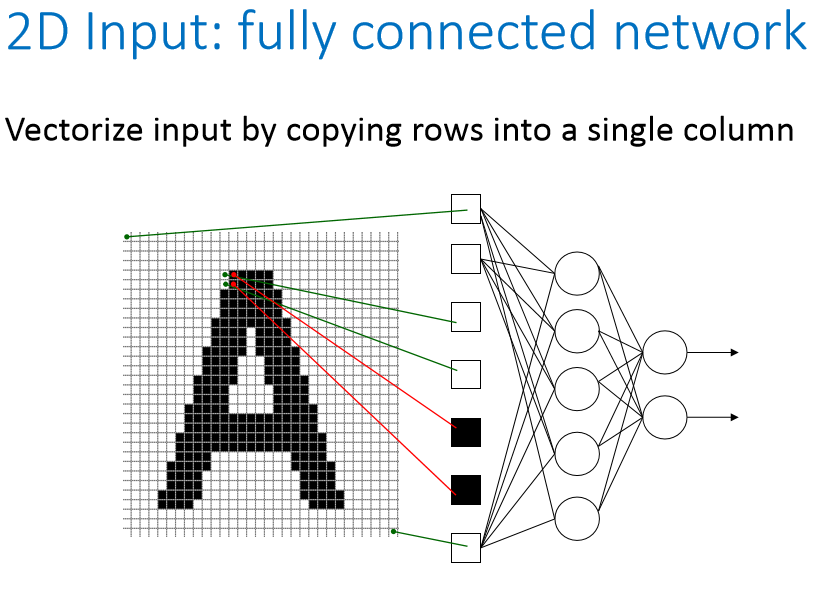
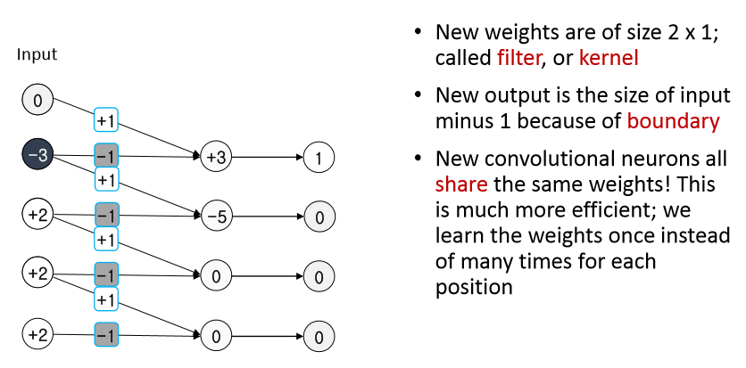
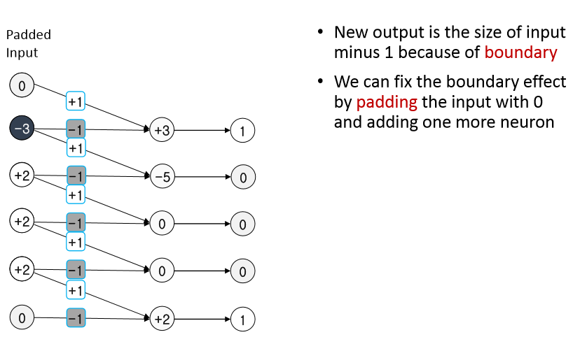
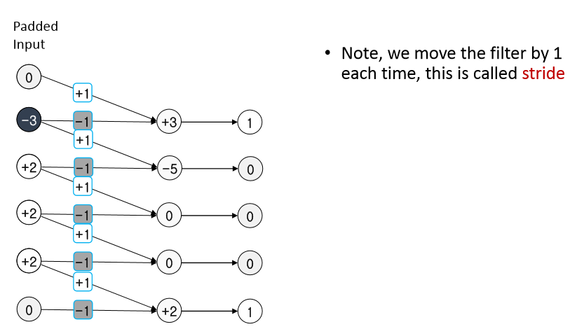
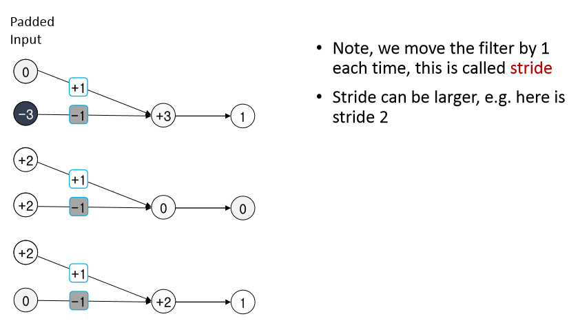
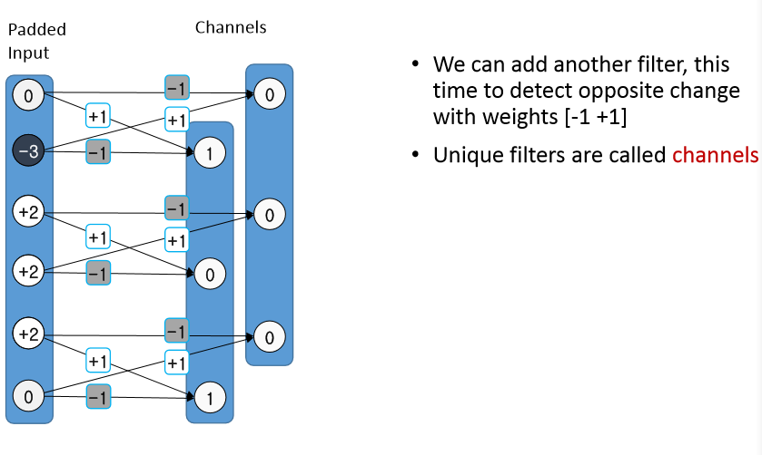
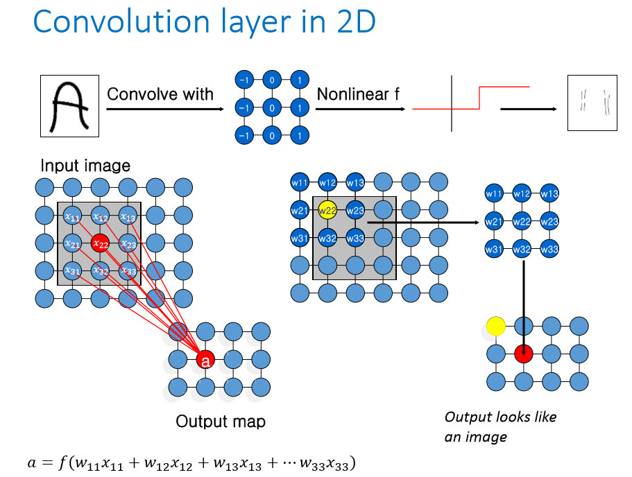
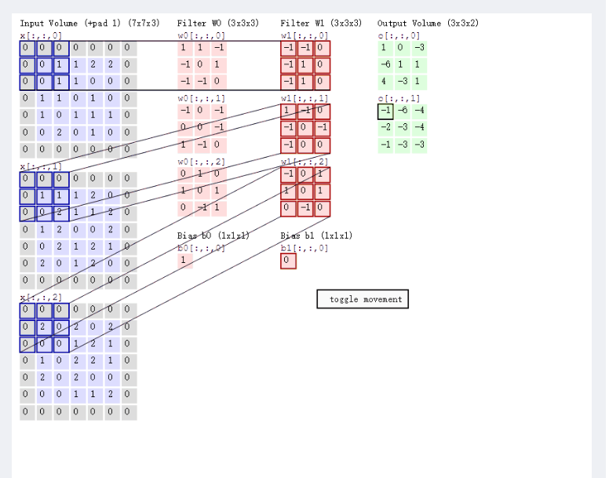
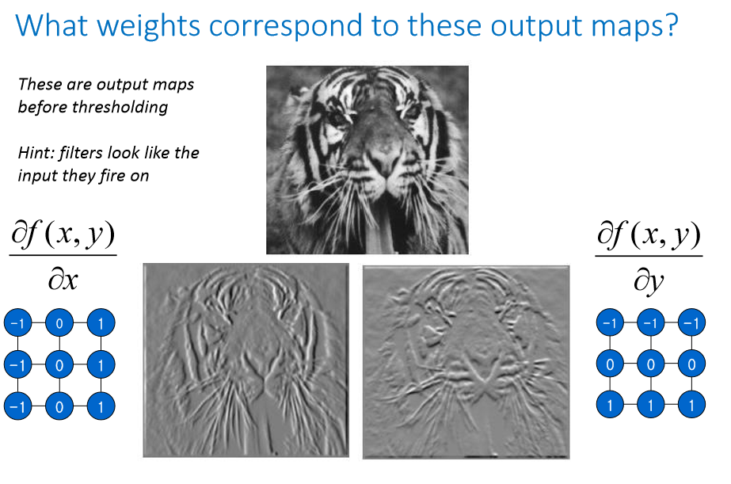
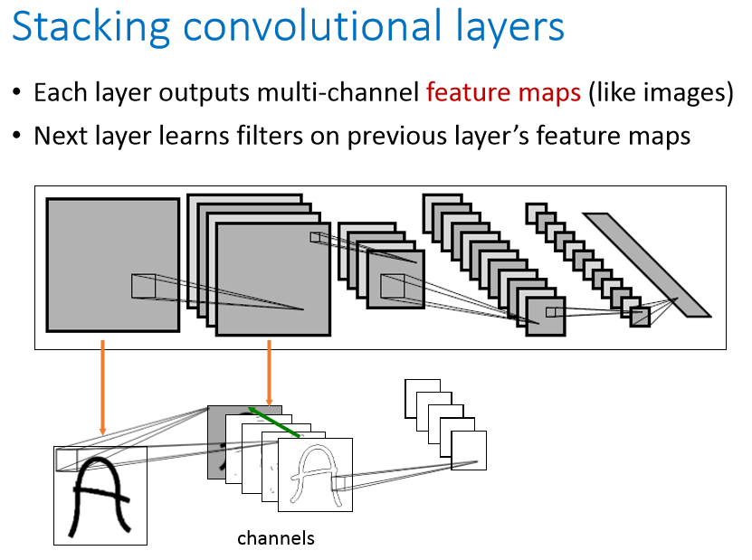

# Convolutional Neural Network (CNN, ConvNet)

## Reference
https://en.wikipedia.org/wiki/Convolutional_neural_network#Receptive_field

## Defnition
A class of deep neural networks, most commonly applied to analyzing visual imagery.

## Motivation
**Why do we need a CNN?**

## Architecture

### Overview
1. Convulution layer.
2. Pooling layer.
3. ReLu layer.
4. Fully connected layer.
5. Loss layer.

### Example:
Input image -> conv ReLu -> pool -> conv ReLu -> flatten -> fully connected -> softmax

### Convolution Layer
The convolutional layer is the core building block of a CNN.
#### 1. Filter/Kernel

#### 2. Padded input

#### 3. Stride

#### 4. Channels and Multiple filters

#### 5. Convolution layer in 2D 

#### 6. Convolution layer in 3D 

#### 7. Different filters get different features

### Pooling Layer
- max-pooling;
- mean-pooling.

#### Max pooling

Pooling layers reduce the dimensions of the data by combining the outputs of neuron clusters at one layer into a single neuron in the next layer.

直觉上，这种机制能够有效地原因在于，一个特征的精确位置远不及它相对于其他特征的粗略位置重要。池化层会不断地减小数据的空间大小，因此参数的数量和计算量也会下降，这在一定程度上也控制了过拟合。

通常来说，CNN的网络结构中的卷积层之间都会周期性地插入池化层。

### Dropout: A classical regularization Technique

## Count the parameters

