# Generative model

## Overview
In statistical classification, including machine learning, two main approaches are called the generative approach and the discriminative approach.

- Given an observable variable X and a target variable Y, a **generative model** is a statistical model of the joint probability distribution on $X × Y$,  $P(X,Y)$;
- A **discriminative model** is a model of the conditional probability of the target $Y$, given an observation $x$, symbolically, $P(Y|X=x)$.

## Examples
Standard examples of each, all of which are linear classifiers, are:
- generative classifiers:
    - naive Bayes classifier
    - linear discriminant analysis
- discriminative model:
    - logistic regression
    - support vector machine

## Discriminative v.s. Generative
判别模型：不能产生新的数据样本；
生成模型，可以产生新的数据样本。

两者都能进行判别。

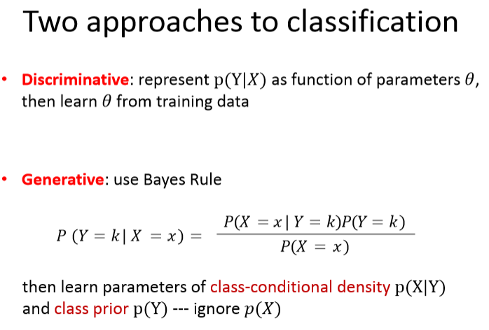

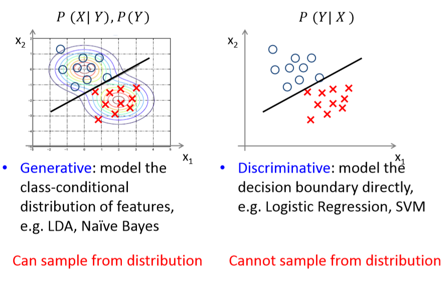

# Linear Discriminant Analysis 
### 线性判别分析 is a generative model

我们看看Webster怎么说这两个词有什么不同：
- discriminative: making distinctions.
- discriminant: a mathematical expression providing a criterion for the behavior of another more complicated expression, relation, or set of relations.
If multiple antenna inputs are available, a very powerful **discriminant** is to see if all of the signals come from the same direction.

## Generative Classifer

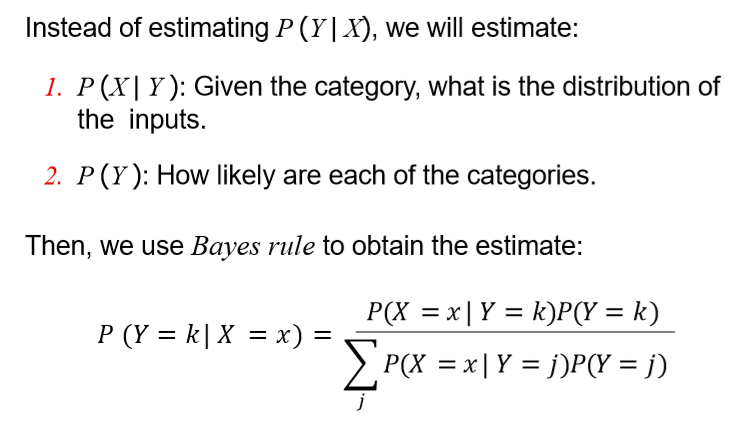

## Linear Discriminant Analysis (LDA) 
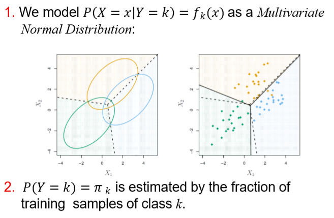

### LDA prior
假设：
We know
$$
P(Y=k) = \pi_k
$$
exactly.

这个是Prior，是 class k 样本数量的占比。

### LDA  class-conditional density
$$
P( X = x | Y = k ) = f_k(x) =\frac{1}{(2\pi)^{p/2} {\Sigma}^{1/2} } \exp(-\frac{1}{2}(x-\mu_k)^T \Sigma^{-1} (x-\mu_k))
$$
**is Mutivariate Normal with density**.

其中，p是变量维度。

### Goal: maximize P( Y = k | X = x ) over k

根据贝叶斯法则，得到：
$$
P( Y = k | X = x ) = \frac{f_k(x) \pi_k}{ P(X=x) }
$$

分母不取决于k，所以可以写成常数C.

$$
P( Y = k | X = x ) = C \times f_k(x) \pi_k
$$

展开：
$$
P( Y = k | X = x ) =  \frac{C \pi_k}{(2\pi)^{p/2} {\Sigma}^{1/2} } \exp(-\frac{1}{2}(x-\mu_k)^T \Sigma^{-1} (x-\mu_k))
$$

把一切不取决于k的量，都吸收进C，得到C':
$$
P( Y = k | X = x ) = C' \pi_k \exp(-\frac{1}{2}(x-\mu_k)^T \Sigma^{-1} (x-\mu_k))
$$

两边取对数：
$$
\log P( Y = k | X = x ) = \log C' + \log \pi_k - \frac{1}{2}(x-\mu_k)^T \Sigma^{-1} (x-\mu_k) 
$$

展开各项：
$$
\log P( Y = k | X = x ) = \log C' + \log \pi_k - \frac{1}{2}(x-\mu_k)^T \Sigma^{-1} (x-\mu_k) 
$$

注意，这里$x$和$\mu_k$都是p by 1 matrix.

$$
\log P( Y = k | X = x ) = \log C' + \log \pi_k - 
\frac{1}{2}(x-\mu_k)^T(\Sigma^{-1}x - \Sigma^{-1}\mu_k)
$$

$$
= \log C' + \log \pi_k - \frac{1}{2} [ x^T\Sigma^{-1}x - \mu_k^T\Sigma^{-1}x - x\Sigma^{-1}\mu_k + \mu_k^T\Sigma^{-1}\mu_k]
$$

$$
= \log C' + \log \pi_k - \frac{1}{2} [ x^T\Sigma^{-1}x + \mu_k^T\Sigma^{-1}\mu_k] + x^T\Sigma^{-1}\mu_k
$$
吸收与k无关的常量，得到：
$$
\log P( Y = k | X = x ) = C'' + \log \pi_k - \frac{1}{2}  \mu_k^T\Sigma^{-1}\mu_k + x^T\Sigma^{-1}\mu_k
$$

我们重新定义一下目标函数：
$$
\delta_k(x) = \log \pi_k - \frac{1}{2}\mu_k^T \Sigma^{-1} \mu_k + x^T \Sigma^{-1}\mu_k
$$
At an input x, we predict the output with the highest $\delta_k(x)$. 

### LDA Linear Decision Boundaries
如何确定分界线？
当输入$x$恰好坐落在分界线时，例如 class k 和 class l 的分界线，那么他们的目标函数，判定这个输入$x$是 class k 和 class l的概率就会相等。

得到：
$$
\delta_k (x) = \delta_l (x)
$$
展开：
$$
\log \pi_k - \frac{1}{2}\mu_k^T \Sigma^{-1} \mu_k + x^T \Sigma^{-1}\mu_k = 
\log \pi_l - \frac{1}{2}\mu_l^T \Sigma^{-1} \mu_l + x^T \Sigma^{-1}\mu_l
$$

决定Decision Boundaries (超平面hyperplane)斜率的是：
$$
\Sigma^{-1}(\mu_k - \mu_l)
$$
决定位置的是：
$$
\log \pi_k - \log \pi_l  - \frac{1}{2}\mu_k^T \Sigma^{-1} \mu_k + - \frac{1}{2}\mu_l^T \Sigma^{-1} \mu_l
$$
仅仅改变$\pi$不会改变超平面的方向，只会平移超平面。

### Estimating $\pi_k$
$$
\pi_k = \frac{ \# \{i; y_i = k\}}{n}
$$
The fraction of training samples of class k. 

### Estimating the parameters of $f_k(x)$
- 均值
$$
\mu_k = \frac{\sum_{i; y_i = k} x_i}{\# \{i; y_i = k\}}
$$
- 协方差

单变量：
$$
    \sigma^2 = \frac{\sum_{k=1}^{K}\sum_{i; y_i = k} (x_i - \mu_k)^2 }{n-K}
$$

多变量：
Compute the vectors of deviations  
$$
(x_1 - \mu_{y_1}), (x_2 - \mu_{y_2}), ... , (x_n - \mu_{y_n})
$$
and use an estimate of its covariance matrix. 

### Quadratic Discriminant Analysis (QDA)

到这为止，我们认为每个class的协方差矩阵是一样的，
如果设置成不一样的，我们的目标函数就会变成：

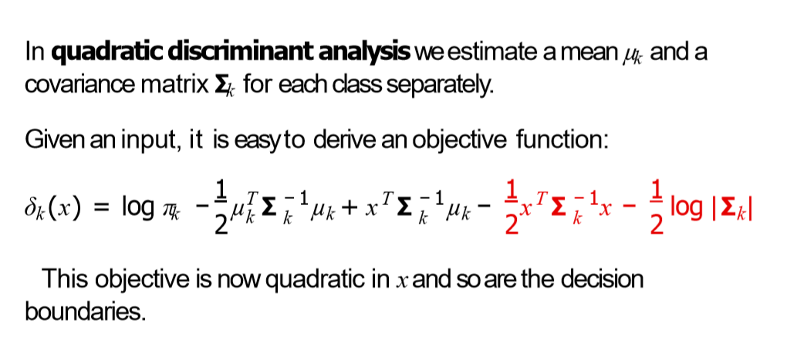

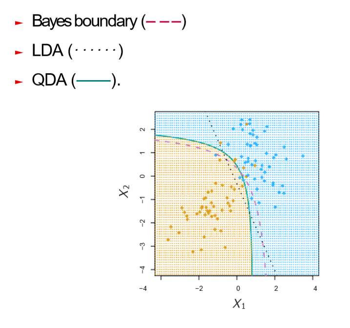

### Illustration of Decision Boundary

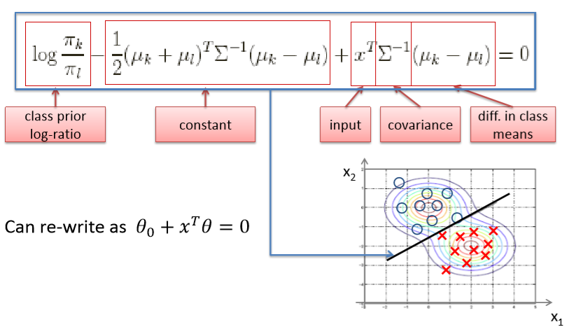

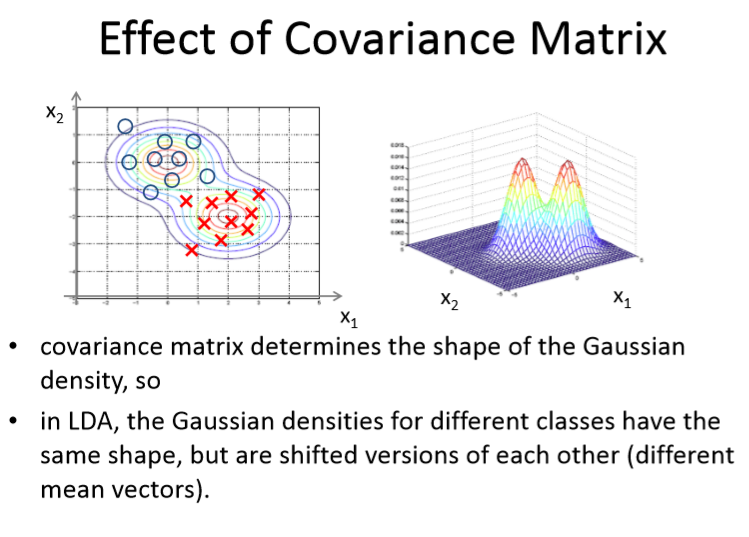

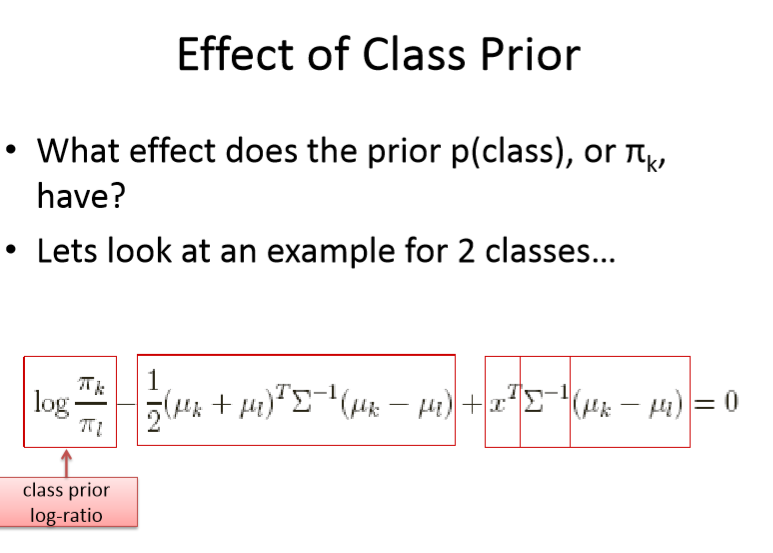

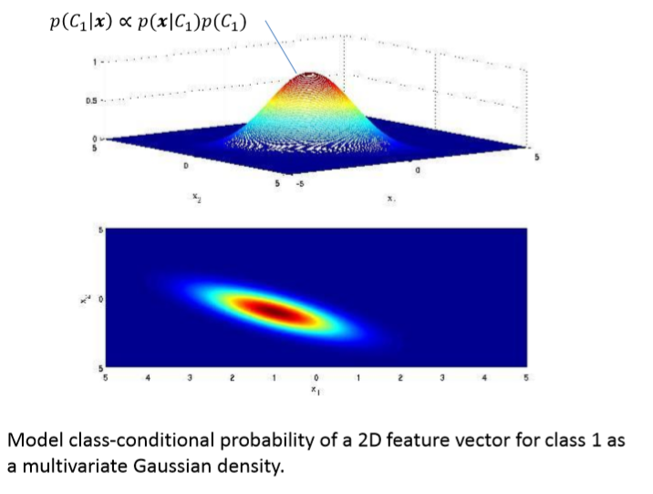

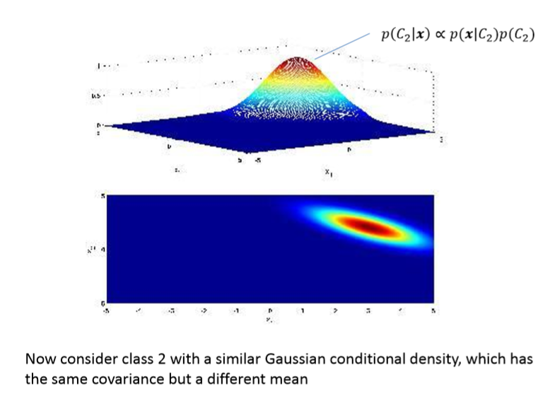

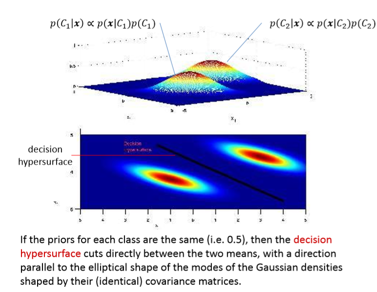

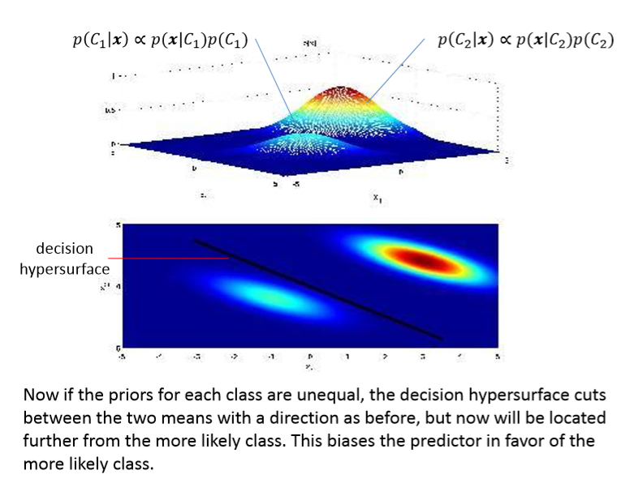

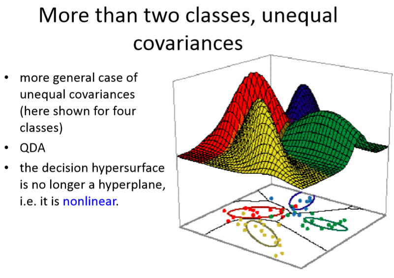

