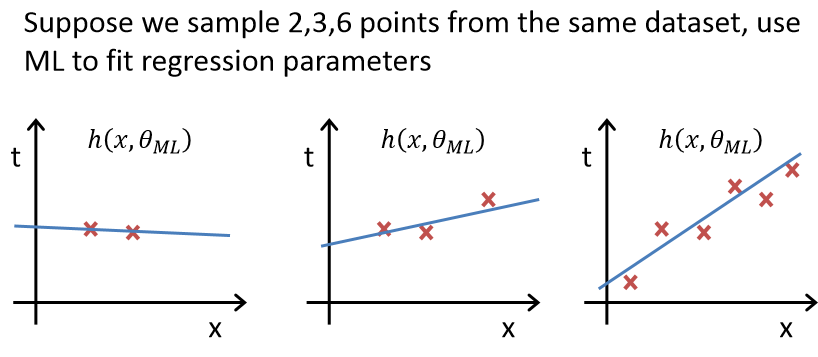
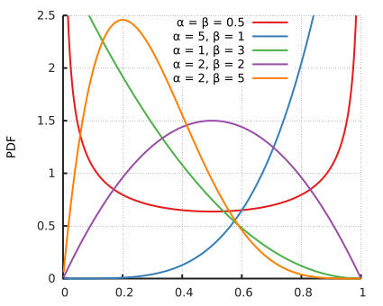
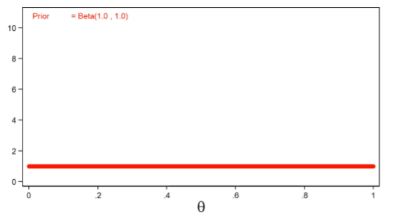
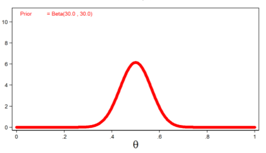
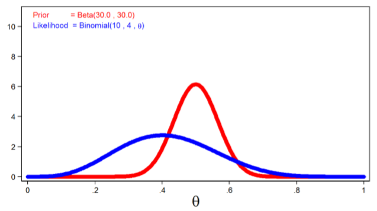
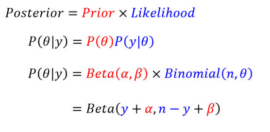
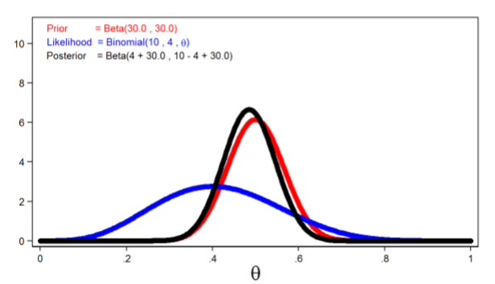

# Bayesian Method

先看贝叶斯公式和条件概率的相关知识。

## Frequentist vs. Bayesian 
- Frequentists: Related to the frequencies of related events.
- Bayesians: Related to our own certainty/uncertainty of events.

- Frequentists: Variation of data in terms of fixed model parameters.

- Bayesians: Variation of beliefs about parameters in terms of fixed observed data.

## Problem with Maximum Likelihood
### Bias
当数据量很少的时候，Maximum Likelihood会有bias,受数据量影响大。

### Overfitting
maximum Likelihood cannot be used to choose complexity of model.

E.g. suppose we want to estimate the number of the basis functions（特征变换函数）. 
- Choose K = 1?
- Or K=15
例如，我们用多项式特征去拟合，K就是多项式的最高次项。

Maximum Likelihood will always choose K that best fits training data (in this case, K=15).

### Solution: Bayesian method
Define a prior distribution over the parameters (**results in regularization)**.

## Frequentist vs. Bayesian 

### Frequentist -- maimize data likelihood
$$
p(D|model) = p(D|\theta)
$$

### Bayesian -- treat $\theta$ as random variable, maximize posterior
Bayes' Rule
$$
p(\theta | D ) = \frac{p(D|\theta)p(\theta)}{p(D)}
$$

- $p(D|\theta)$ is the data likelihood which is the same as before in Maximum Likelihood.
- $p(\theta)$ is the prior over the model parameters, which is a new **distribution** we model; specifies which parameters are more likely a priori, **before seeing any data**.
- $p(D)$ does not depend on $\theta$, constant when choosing $\theta$ with highest posterior probability.

## Prior over model parameters -- Intuition

### Prior Distribution $p(\theta)$
Prior distributions $p(\theta)$ are probability distributions of model parameters **based on some a priori knowledge about the parameters**.  

换句话说，这个先验分布，与你观测到的实验结果是相互独立的。

Prior distributions are independent of the observed data. 

## Example: toss a coin
What is the probability of heads $(\theta)$? 

在这之前，先看一个beta分布。为什么我们选择这个分布，后续会讲。
### Beta Distribution 
$$Be(\alpha, \beta)$$
#### Probability density function
$$
p(x; \alpha, \beta) = \frac{x^{\alpha - 1}(1-x)^{\beta-1}}{\int^1_0 u^{\alpha-1}(1-u)^{\beta-1}du} 
$$

$$
= \frac{\Gamma(\alpha+\beta)}{\Gamma(\alpha)\Gamma(\beta)}x^{\alpha - 1}(1-x)^{\beta-1}
$$

where
$$
\alpha > 0, \beta > 0
$$

$$
\Gamma(z) = \int^{\infty}_0 \frac{t^{z-1}}{e^t}dt 
$$
if $z$ is a complex number with a positive real part.

$$
\Gamma(z) = (z-1)!
$$
if $z$ is a positive integer.

回顾一下贝叶斯方法：

### Bayes' Rule
$$
p(\theta | y ) = \frac{p(y|\theta)p(\theta)}{p(y)}
$$

$p(\theta)$是我们刚刚选择的beta分布。

### Likelihood function
我们看看已知的实验结果：
- n = 10 coin tosses
- y = 4  number of heads

$p(y|\theta)$ 是Likelihood function for the Data.

独立重复实验，服从伯努利分布。
$$
p(y|\theta) = Binomial(n,\theta) = C^y_n\theta^y(1-\theta)^{n-y}
$$

看一下刚刚的beta分布，统计意义上是我们对参数的估计。

### Prior Distribution
记住，这个Prior是我们开始实验之前，就对这个分布有所了解。
#### Uninformative Prior
如果我们事先对这个分布没有任何了解，那我们的Prior就是uninformative.

参数设置为：
$$
\alpha = \beta = 1
$$

beta分布就会变成：
$$
p(\theta) = 1
$$
意义就是无论你抛硬币多少次，$\theta$正面朝上的次数，总是均匀的。

#### Informative Prior
我们事先就知道，正面朝上的概率大概为0.5.

参数设置为：
$$
\alpha = \beta = 30
$$

beta分布就会变成：
$$
p(\theta) = \frac{60!}{30! \times 30!}\theta^{29}(1-\theta)^{29}
$$

### Prior and Likelihood PDF
看一下Prior和Likelihood的概率密度分布。

如果我们只看Likelihood，它是有bias的，因为我们只抛了10次硬币，正面朝上只有4次。

### Posterior Distribution
$$
p(\theta | y ) = \frac{p(y|\theta)p(\theta)}{p(y)}
$$

这里选择beta分布，是为了数学上计算的方便。

看我们Posterior的概率密度分布：

Likelihood被Prior修正了。

## Bayesian Linear Regression
直观上讲，我们用贝叶斯来修正Linear Regression，比如说，加上高斯噪声。

#### Reference
https://towardsdatascience.com/introduction-to-bayesian-linear-regression-e66e60791ea7

从频率主义者的角度，就是比较常规的Gradient descent梯度下降法来进行训练。最终会得到一个solution:
$$
y = \theta^TX
$$

但是贝叶斯方法的y，是y服从一个概率分布，比如：
$$
N(\theta^TX, \sigma^2I)
$$
把原来频率主义者得到的y当作是均值，再叠加上高斯噪声。

The posterior probability of the model parameters is conditional upon the training inputs and outputs:
$$
p(\theta|y,X) = \frac{p(y|\theta, X)p(\theta |X)}{p(y|X)}
$$

$$
Posterior = \frac{Likelihood \times Prior}{Normalization}
$$
