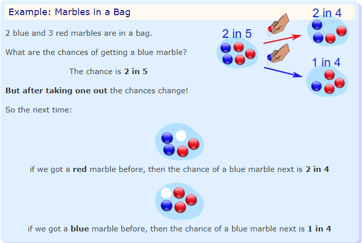
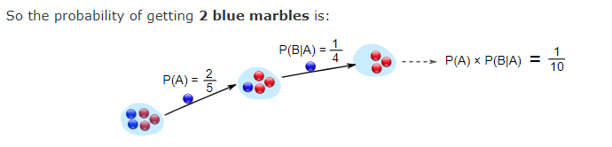
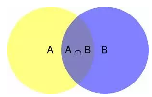
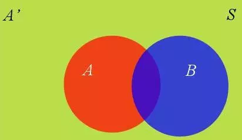

# Conditional Probability and Bayes' Theorem

## Reference
https://en.wikipedia.org/wiki/Joint_probability_distribution  
https://www.mathsisfun.com/data/probability-events-conditional.html

## Independent/Dependent Event

### Indenpendent Event
Events can be "Independent", meaning each event is not affected by any other events.

**Example: Tossing a coin.**

### Dependent Event
But events can also be "dependent", which means they can be affected by previous events.

This is because we are removing marbles from the bag.

**So the next event depends on what happened in the previous event, and is called dependent.**

## Conditional Probability 条件概率

### Definition
Conditional Probability of B given A.
$$P(B|A) = \frac{P(A \ and \ B)}{P(A)}$$
$$P(B|A) = \frac{P(A \cap B)}{P(A)}$$

### How do we get this definition from scratch?
Event A is "get a Blue Marble first".  
Event B is "get a Blue Marble second".  

And we write it as
$$P(A \cap B) = P(A)P(B|A) = \frac{2}{5}\times\frac{1}{4}=\frac{1}{10}$$

这条公式可以理解成一种链式反应。

如果从原来的公式理解，可以理解为事件A的发生，缩小了概率空间

$$
P(B|A) = \frac{P(A \cap B)}{P(A)} = \frac{1}{10} \div \frac{2}{5} = \frac{1}{4}
$$

再看一个例子：

可以很清楚地看到：在事件B发生的情况下，事件A发生的概率就是
$$
P(A|B) = \frac{P(A \cap B)}{P(B)}
$$
B事件的发生，对A事件发生的影响就是：缩小了分母。
## 互斥事件与独立事件

## Probability Space 概率空间

## Prior Probability 先验概率
The prior probability of a random event or an uncertain proposition is the **unconditional probability** that is assigned **before** any relevant evidence is taken into account.

事件的先验概率是指一个非条件概率（这个概率不考虑其他相关的证据）。

## Posterior probability 后验概率
In Bayesian statistics, the posterior probability of a random event or an uncertain proposition is the **conditional probability** that is assigned **after** the relevant evidence or background is taken into account.

在贝叶斯统计中，一个随机事件或者一个不确定事件的后验概率是在考虑和给出相关证据或数据后所得到的条件概率。

## Total Probability Theorem 全概率公式
假设$\{B_n : n = 1, 2, 3, ... \}$是一个概率空间的分割，即$B_n$为一完备事件组，对于任意事件$A$，有全概率公式：
$$
P(A) = \sum_{i=1}^{n}P(A \cap B_i)
$$
### 全概率公式的推导与展开
我们看这张图，事件B发生的概率可以表达为：
$$
P(B) = P(B \cap A) + P(B \cap \bar A)
$$

在前面我们推到过条件概率：
$$
P(B|A) = \frac{P(A \cap B)}{P(A)}
$$
变形一下：
$$
P(B \cap A) = P(A)P(B|A)
$$
同理可得：
$$
P(B \cap \bar A) = P(\bar A)P(B|\bar A)
$$

代入得到**全概率公式**：
$$
P(B) =  P(B \cap A) + P(B \cap \bar A)
$$
$$
P(B) = P(B|A)P(A) + P(B| \bar A)P(\bar A)
$$
推广到多个事件对概率空间的分割：
$$
P(B) = \sum_{i=1}^{n}P(B \cap A_i) = \sum_{i=1}^{n} P(B|A_i)P(A_i)
$$

#### 条件概率的另一种写法
原来的写法：
$$
P(B|A) = \frac{P(A \cap B)}{P(A)}
$$
右边分母用全概率公式代替：
$$
P(B|A) = \frac{P(A \cap B)}{\sum_{i=1}^{n}P(A \cap B_i)}
$$

## Bayes' Theorem 贝叶斯定理
是关于随机事件A和B的条件概率的一则定理。
$$
P(A|B) = \frac{P(B|A)P(A)}{P(B)}
$$
推广：假设$\{ A_j \}$是事件集合里的部分集合，对于任意$A_i$,贝叶斯定理表示为：
$$
P(A_i|B) = \frac{P(B|A_i)P(A_i)}{\sum_{j=1}^{n}P(B|A_j)P(A_j)}
$$

### 从条件概率推导贝叶斯定理
已知：
$$
P(B|A) = \frac{P(A \cap B)}{P(A)}
$$
$$
P(A|B) = \frac{P(B \cap A)}{P(B)}
$$
合并上式，消去$P(A \cap B)$，得到：
$$
P(A|B)P(B) = P(B|A)P(A)
$$
即：
$$
P(A|B) = \frac{P(B|A)P(A)}{P(B)}
$$
推导结束。

### 如何理解贝叶斯定理
$$
P(A|B) = P(A)\frac{P(B|A)}{P(B)}
$$
我们求解的是，事件B发生的情况下，事件A发生的概率。
- $P(A)$称作先验概率，即不管事件B发布发生，我们对事件A发生的概率的判断。
- $P(A|B)$是后验概率，在事件B发生后,我们对事件A发生的概率进行重新评估。
- $\frac{P(B|A)}{P(B)}$是调整因子，可能性函数。
- 因此，我们可以把条件概率理解为：
$$
后验概率 = 先验概率 \times 调整因子
$$

- 如果调整因子$\frac{P(B|A)}{P(B)}$大于1，意味着先验概率被增强；
- 如果等于1，意味着事件B无助于判断事件A的可能性；
- 如果小于1，意味着先验概率被削弱。
  
### 例子：容器里的球
现在分别由A和B两个容器，A里面由7个红球和3个白球，B里面有1个红球和9个白球，已知从这两个容器里面任意抽出了一个球，在抽出的球是红球的情况下，这个红球来自容器A的概率是多少？

解：

定义事件R为抽到红球，事件A为抽到的球来自容器A.
$$
P(A|R) = P(A) \frac{P(R|A)}{P(R)}
$$
$$
P(A) = \frac{7+3}{7+3+1+9} = \frac{1}{2} \\
P(R) = \frac{7+1}{20} = \frac{2}{5}\\
P(R|A) = \frac{P(R \cap A)}{P(A)} = \frac{\frac{7}{20}}{\frac{1}{2}} = \frac{7}{10}
$$
调整因子：
$$
\frac{P(R|A)}{P(R)} = \frac{\frac{7}{10}}{\frac{2}{5}} = \frac{7}{4} > 1
$$
事件A由于事件R的发生，事件A的发生的可能性增大。
$$
P(A|R) = P(A) \frac{P(R|A)}{P(R)} = \frac{1}{2} \times \frac{7}{4} = \frac{7}{8}
$$

### 例子：抛硬币
https://www.zhihu.com/people/xie-yi-ze-63/posts

有ABC三种硬币，它们投掷一次，正面朝上的概率分别为0.8, 0.5, 0.2. 已知某一枚硬币是硬币A的概率为0.2，是硬币B的概率为0.6，是硬币C的概率为0.2，现在投掷一次这枚硬币，结果是正面朝上，问这个硬币是硬币A的概率是多少？问如果再投掷一次这枚硬币，正面朝上的概率是多少？

解：

### 例子：酒馆
有一个酒鬼，每天有90%的可能性出门，如果出门，等概率地去ABC三家酒馆，现在有一天，警察在AB酒馆都没见到酒鬼，问在C酒馆找到酒鬼的概率。

解：

设酒鬼在酒馆A为事件A，P(A) = 0.3; 

在酒馆B为事件B，P(B) = 0.3; 

在酒馆C为事件C，P(C) = 0.3; 

在家为事件H，P(H) = 0.1.
$$
P(C|\bar A \cap \bar B) = \frac{P(C \cap \bar A \cap \bar B)}{P(\bar A \cap \bar B)} = \frac{0.3}{1-0.3-0.3} = \frac{3}{4}
$$

## Joint Probability
在概率论中, 对两个随机变量$X$和$Y$，其联合分布是同时对于$X$和$Y$的概率分布。

### 离散随机变量的联合分布
联合分布**概率质量函数**为
$$Pr(X = x \ and \ Y = y) \\
= P(Y=y | X=x)P(X=x) \\ 
= P(X=x|Y=y)P(Y=y)
$$

$$
\sum_{x}\sum_{y}P(X=x \ and \ Y=y) = 1
$$

在概率论中，概率质量函数（probability mass function，简写为pmf）是离散随机变量在各特定取值上的概率。**概率质量函数和概率密度函数不同之处**在于：概率质量函数是对离散随机变量定义的，本身代表该值的概率；概率密度函数是对连续随机变量定义的，本身不是概率，只有对连续随机变量的概率密度函数在某区间内进行**积分后才是概率**。

### 连续随机变量的联合分布
联合分布概率密度函数为$f_{X,Y}(x, y)$，其中$f_{Y|X}(y|x)$和$f_{X|Y}(x|y)$分别代表$X = x$时$Y$的条件分布以及$Y = y$时$X$的条件分布；$f_X(x)$和$f_Y(y)$分别代表X和Y的边缘分布。

$$
\int_x \int_y f_{X,Y}(x, y) dy dx = 1
$$

### 独立变量的联合分布

对于互相独立的事件$P(X)及P(Y)$，任意$x$和$y$而言有离散随机变量

$$P(X=x \ and \ Y=y) = P(X=x) \cdot P(Y=y)
$$

或者有连续随机变量
$$
p_{X,Y}(x,y)=p_{X}(x) \cdot p_{Y}(y)
$$

## Marginal Probability

