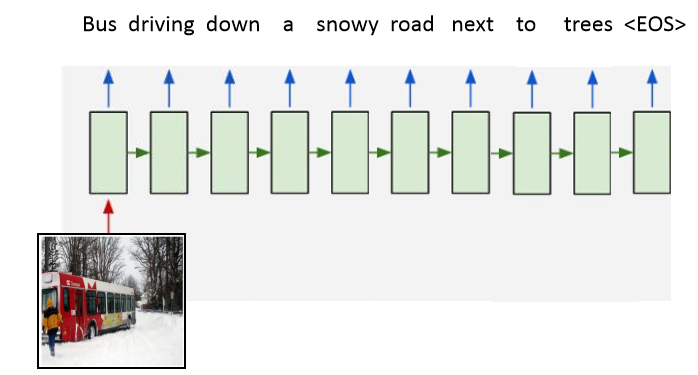

# Recurrent Neural Network (RNN)

## Reference
https://en.wikipedia.org/wiki/Recurrent_neural_network

## Definition
A recurrent neural network (RNN) is a class of artificial neural networks where connections between nodes form a directed graph along a temporal sequence.

This allows it to exhibit temporal dynamic behavior.

Derived from feedforward neural networks, RNNs can use their internal state (memory) to process variable length sequences of inputs. This makes them applicable to tasks such as unsegmented, connected **handwriting recognition or speech recognition**.

## Sequences in our world
- Audio
- Text
- Video
- Weather
- Stock market

## Limitations of Feed-Forward Network
- Fixed length
  - Inputs and outputs are fixed length
- Independence
  - Data (example: images) are independent of one another

## Advantages of RNN
- Variable length
  - We would like to accommodate temporal sequences of various lengths.
- Temporal dependence 
  - To predict where a pedestrian is at the next point in time, this depends on where he/she were in  the previous time step(s).

## RNN Architecture

### RNN Application

#### One to one: image classification 图像分类

#### One to many: image captioning 图像注解

#### Many to one: Sentiment analysis 情感分析

#### Many to many: Machine translation 机器翻译

## Insight into the RNN

### Notation

### Example

