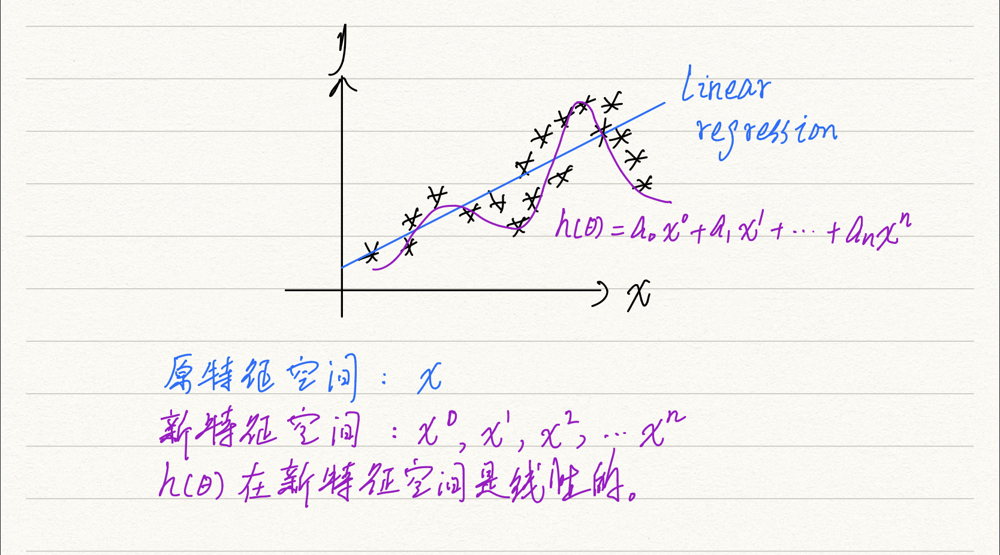
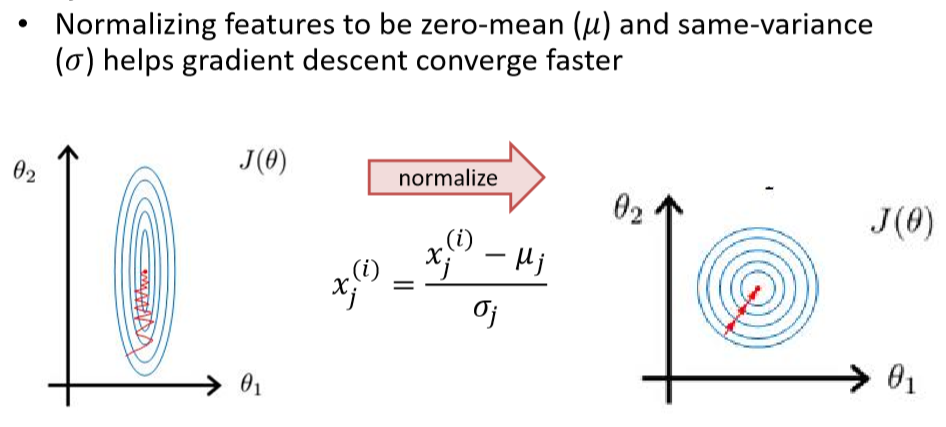
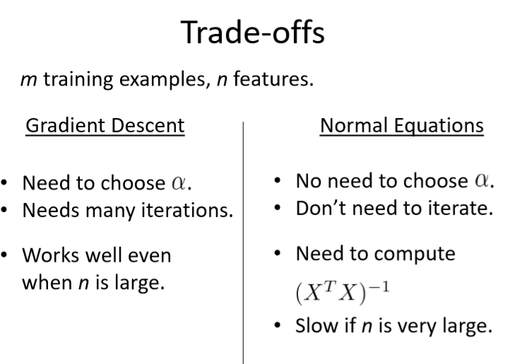
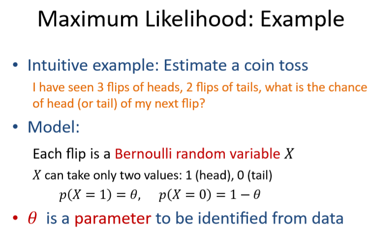
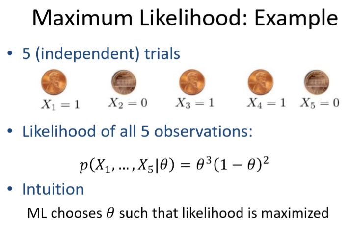

# Linear Regression

###### Author: Ziqi Tan
###### Date: Feb 22, 2020
--- 

## Definition
In statistics, linear regression is a linear approach to modeling the **relationship** between **a scalar response** (or dependent variable) and **one or more explanatory variables** (or independent variables).

### Example: 

## Singlevariate Linear Regression

### Hypothesis
$$h_{\theta}(x) = \theta_{0} + \theta_{1}x$$
where $\theta_{j}$ are paraters.

### Cost Function
$$J(\theta_{0}, \theta{1}) = \frac{1}{2m}\sum_{i=1}^{m}(h_{\theta}(x^{(i)}) - y^{(i)})^{2}$$
where $m$ is the number of samples and we use superscript $i$ here to notate the sample.

Cost function describes the distance between your prediction and the ground truth.

### True of False Question
Question: Suppose we use polynomial features for linear regression, then the hypothesis is linear in the original features.
#### Answer: False, it is linear in the new polynomial features.

## Multivariate Linear Regression
### hypothesis
$$h_{\theta}(x) = \theta_{0} + \theta_{1}x_1 + \theta_2 x_2 + \cdot \cdot \cdot + \theta_n x_n$$

For convenience of notation and matrix multiplication, define $x_0 = 1$.

### Cost Function
$$J(\theta_{j}) = \frac{1}{2m}\sum_{i=1}^{m}(h_{\theta}(x^{(i)}) - y^{(i)})^{2}$$
where $j=0,1,2, ... n$.

## Minimize the cost function $J(\theta)$

### Two potential solutions
1. Gradient descent.  
    * Start with a guess for $\theta$.
    * Change $\theta$ to decrese $J(\theta)$.
    * Until reach minimum.
2. Direct minimization.
    * Take derivative, set to zero.
    * Sufficient condition for minima.
    * Not possible for most "interesting" cost functions.

### Gradient Descent Algorithm

Set $\theta$ = random value.

Repeat {
$$\theta_j = \theta_j - \alpha \frac{\partial }{\partial \theta_j}J(\theta)$$
} until convergence.

where $\alpha$ is the learning rate.

#### We take Least Squares Cost Function as an example.
SSD (Sum of square differences), also SSE (Sum of Square Errors).
$$J(\theta_{j}) = \frac{1}{2m}\sum_{i=1}^{m}(h_{\theta}(x^{(i)}) - y^{(i)})^{2}$$
where $j=0,1,2, ... n$.

$$h_{\theta}(x) = \theta_{0} + \theta_{1}x_1 + \theta_2 x_2 + \cdot \cdot \cdot + \theta_n x_n$$

Calculation.

$$
\frac{\partial }{\partial \theta_j}J(\theta)
= \frac{1}{2m}\sum_{i=1}^{m}\frac{\partial }{\partial \theta_j}(h_{\theta}(x^{(i)}) - y^{(i)})^{2} \\
= \frac{1}{2m}\sum_{i=1}^{m} \cdot 2 \cdot (h_{\theta}(x^{(i)}) - y^{(i)}) \cdot \frac{\partial }{\partial \theta_j}(h_{\theta}(x^{(i)}) - y^{(i)}) \\
= 
\frac{1}{m}\sum_{i=1}^{m}(h_{\theta}(x^{(i)}) - y^{(i)})\frac{\partial }{\partial \theta_j}(\theta_{0} + \theta_{1}x_1^{(i)} + \theta_2 x_2^{(i)} + \cdot \cdot \cdot + \theta_n x_n^{(i)} - y^{(i)})\\
= \frac{1}{m}\sum_{i=1}^{m}(h_{\theta}(x^{(i)}) - y^{(i)})x_j
$$

Therefore, **loss gradient** is denoted as follows: 
$$\frac{\partial }{\partial \theta_j}J(\theta) = (h_{\theta}(x^{(i)}) - y^{(i)})x_j$$

#### Gradient descent
Set $\theta$ = random value.

Repeat {
$$\theta_j = \theta_j - \alpha \frac{1}{m}\sum_{i=1}^{m}(h_{\theta}(x^{(i)}) - y^{(i)})x_j$$
} until convergence.

where $\alpha$ is the learning rate.

## Feature Normalization (Feature Scaling)
### Motivation
If features have very different scale, gradient descent can get "stuck" since $x_j$ affects size of gradient in the direction of $j^{th}$ dimension.

## Definition
Feature scaling is a method used to **normalize the range** of independent variables or features of data. In data processing, it is also known as data normalization and is generally performed during the **data preprocessing** step.

### Methods
#### Rescaling (min-max normalization)

$$x' = \frac{x-x_{min}}{x_{max}-x_{min}}$$

#### Mean normalization
$$x'=\frac{x- \bar x}{x_{max}-x_{min}}$$
where $\bar x$ is the average value.

#### Standardization (Z-score Normalization)
$$x' = \frac{x- \bar x}{\sigma}$$
where $\bar x$ is the average value and $\sigma$ is standard deviation.

#### Scaling to unit length
To be continued...

### Direction solution to minimize the cost function
Set 
$$\frac{\partial J(\theta)}{\partial \theta_j} = 0$$

#### Matrix Notation
$$
\frac{\partial J(\theta) }{\partial \theta_j}
= \frac{1}{2m}(X\theta - y)^T(X\theta - y) = 0$$
where 
$X$ is a $m \times n$ matrix, 

$\theta$ is a $n \times 1$ matrix,

$y$ is a $m \times 1$ matrix.

Calculation.
$$
(X\theta - y)^T(X\theta - y) \\
= ( \theta^T X^T - y^T )(X \theta - y)\\
= \theta^T X^T X \theta - y^T X \theta - \theta^T X^T y +  y^T y \\
= \theta^T X^T X \theta - 2y^T X \theta + y^T y
$$
Ignore constant multiplier.
$$
\frac{\partial J(\theta) }{\partial \theta_j} \propto X^T X \theta - X^T y = 0
$$

$$
\theta = (X^TX)^{-1}X^T y
$$

## Maximum Likelihood: Another view of cost function

### New cost function
$$p( (x^{(i)}, y^{(i)}) | \theta )$$
maximize probability of data given model.

该方法的核心是条件概率，条件概率是给定参数$\theta$时，最大化已知观测结果的概率，在这个例子里面，$X$就是五次观察结果(Observations)，$\theta$是抛出硬币正面朝上的概率，我们在条件概率里面，认为这个参数是给定的，我们如何对这个参数取值，才能使得这个条件概率最大化。

Calculation:
$$ 
\frac{d}{d\theta}(\theta^3(1-\theta)^2) 
= \theta^2(5\theta^2 - 8\theta + 3) = 0
$$

Therefore, $\theta_{ML} = \frac{3}{5}.$
