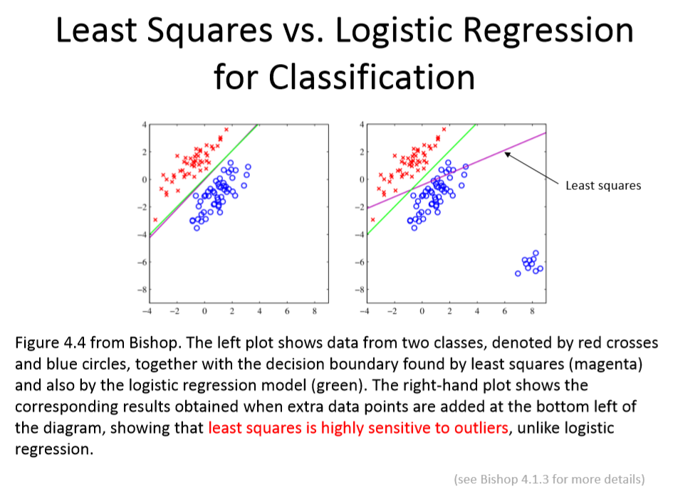
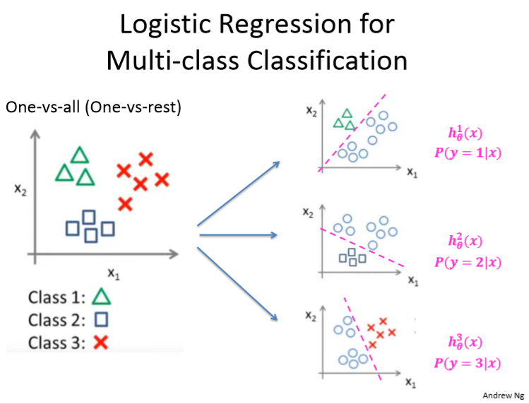
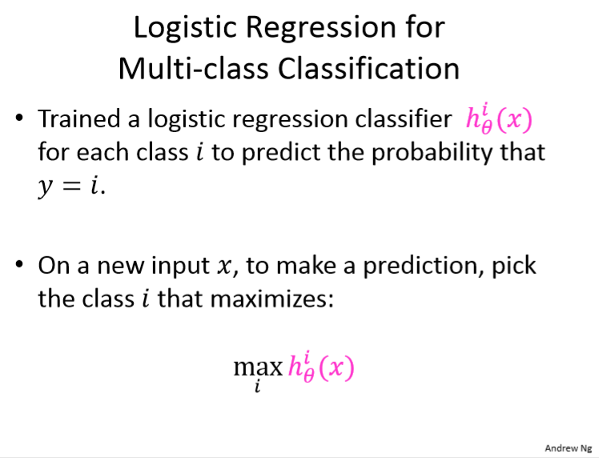
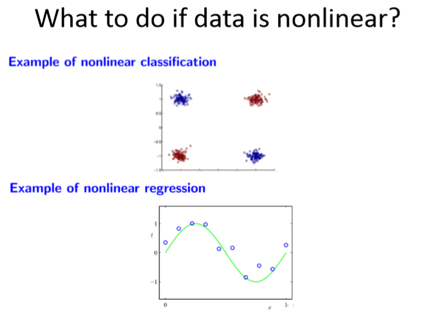
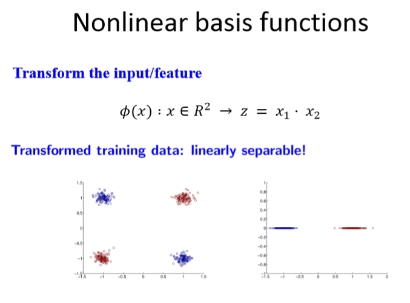
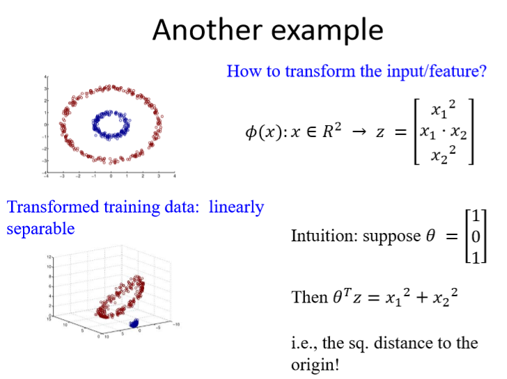

# Classification

###### Author: Ziqi Tan
###### Date: Feb 23, 2020
--- 

## Binary Classification
First of all, let's consider a binary classification problem.

$$y \in \{ 0, 1 \}$$

**Why not** use least squares regression?
$$  \argmin \limits_{\theta}
    \frac{1}{2m}\sum_{i=1}^{m}(h_{\theta}(x^{(i)}) - y^{(i)})^2
$$

###  Reasons
1. Least squares cost function does not work well, when your label is a binary number.
2. Least squares is highly sensitive to outliers.
   

That's why we introduce Logistic Regression.

## Logistic Regression

### Sigmoid Function
We use sigmoid function to map $h_{\theta}(x)$ to [0, 1]:

$$ \sigma(z) = \frac{1}{1+e^{-z}} $$

### Derivative of Sigmoid Function
$$\frac{\partial \sigma(z)}{\partial z} 
=\frac{\partial }{\partial z}  (\frac{1}{1+e^{-z}})
=(-1)(1+e^{-z})^{-2}(-e^{-z})
=\frac{e^{-z}}{(1+e^{-z})^{2}}
$$
$$
= \sigma(z)(1-\sigma(z))
$$

$$
= \frac{1}{1+e^{-z}}(1-\frac{1}{1+e^{-z}})
$$

$$
= \frac{(1+e^{-z})-1}{(1+e^{-z})^{2}}
$$
Therefore, this is an interesting result.
$$\frac{\partial \sigma(z)}{\partial z}= \sigma(z)(1-\sigma(z))$$

### Hypothesis
$$
h_{\theta}(x) = \sigma(\theta^Tx) = \frac{1}{1+e^{-\theta^Tx}}
$$

Predict "y=1", if $h_{\theta}(x) \geq 0.5$.  
Predict "y=0", if $h_{\theta}(x) < 0.5$.

### Logistic Regression Cost Function --- Cross Entropy
---
#### Information Entropy
衡量一条信息的量的多少。
$$ H(X) = - \sum^{n}_{i=1}P(x_i)log_bP(x_i) $$
b通常取2, n是随机变量取值的n种可能性。

---
#### Cross Entropy
In information theory, the cross entropy between two probability distributions p and q over the **same underlying set of events measures** the average number of bits needed to identify an event drawn from the set if a coding scheme used for the set is optimized for an estimated probability distribution q, rather than the true distribution p.

$$H(p, q) = -\sum_{x\in X}^{}p(x) \log q(x)$$

---
## Cross Entropy Loss Function
Cross entropy can be used to define a loss function in machine learning and optimization.

### Meanning of p and q
#### The true probability $p_{i}$ is the true label, and the given distribution $q_{i}$ is the predicted value of the current model.

More specifically, consider **logistic regression**, which (among other things) can be used to classify observations into two possible classes (often simply labelled 0 and 1).

The output of the model for a given observation, given a vector of input features $x$, **can be interpreted as a probability**, which serves as the basis for classifying the observation.

The probability is modeled using the logistic function 
$$g(z)=1/(1+e^{-z})$$ 
where $z$ is some function of the input vector **$x$**, commonly just a linear function.

The probability of the output $y=1$ and $y=0$ is given by
$$ q_{y=1} = \hat y = g(x\theta  ) = \frac{1}{1+e^{-x\theta}}$$

$$ q_{y=0} = 1- \hat y$$

Having set up our notation, 
$$p \in\{y, 1-y\}, q\in\{\hat y, 1-\hat y\}$$
we can use cross entropy to get a measure of dissimilarity between p and q.

$$H(p, q) = -\sum_{i=1}^{}p_i \log q_i = -y\log\hat y - (1-y)\log (1-\hat y)$$

### Why does it work so well?

Now we use different notations.
$$Cost(h_{\theta}(x), y) = -y\log h_{\theta}(x) - (1-y)\log (1-h_{\theta}(x))$$

Given $y=1$, we hope our prediction $h_{\theta}(x)$ gets close to 1.

Given $y=0$, we hope our prediction $h_{\theta}(x)$ gets close to 0.

Let's see what we've got when we plug in $y=0$ and $y=1$.

$$Cost(h_{\theta}(x), y) = 
\left\{
\begin{array}{rl}
\log h_{\theta}(x)  & y=1 \\
\log (1-h_{\theta}(x))  & y=0 
\end{array}
\right.
$$

It obviously fulfills our expection of the cost function.

### Derivative with respect to $\theta$
**Cost function and hypothesis.**
$$J(\theta) = 
\frac{1}{m}\sum_{i=1}^{m}Cost(h_{\theta}(x^{(i)}), y^{(i)}) 
$$
$$
= \frac{1}{m}\sum_{i=1}^{m}\{-y\log h_{\theta}(x^{(i)}) - (1-y^{(i)})\log (1-h_{\theta}(x^{(i)}))\}
$$
where m is the number of samples.
$$
h_{\theta}(x) = \sigma(\theta^Tx) = \frac{1}{1+e^{-\theta^Tx}}
$$

**Derivative:**
$$\frac{\partial J(\theta)}{\partial \theta} = 
\frac{\partial J(\theta)}{\partial h_\theta(x)}\frac{\partial h_\theta(x)}{\partial \theta}
$$

$$
\frac{\partial J(\theta)}{\partial h_\theta(x)}
= \frac{1}{m}\sum_{i=1}^{m} \{
-y^{(i)}\frac{1}{h_\theta(x^{(i)})}-(1-y^{(i)})\frac{-1} {1-h_\theta(x^{(i)})} \}
$$
$$
= \frac{1}{m}\sum_{i=1}^{m} \{ \frac{-y^{(i)}}{h_\theta(x^{(i)})}+\frac{1-y^{(i)}}{1-h_\theta(x^{(i)})} \}
$$
$$
= \frac{1}{m}\sum_{i=1}^{m} \{ \frac{h_\theta(x^{(i)})-y^{(i)}}{h_\theta(x^{(i)})(1-h_\theta(x^{(i)}))} \}
$$

Focus on the demoninator $h_\theta(x)(1-h_\theta(x))$, it **seems like the derivative of a sigmoid function**.

$$\frac{\partial h_\theta(x)}{\partial \theta} 
= \frac{\partial }{\partial \theta}\sigma(x)
= \frac{\partial }{\partial \theta}\frac{1}{1+e^{-\theta x}}
= \frac{x \cdot e^{-\theta x}}{(1+e^{-\theta x})^2}
= x \cdot \sigma(x)\cdot (1-\sigma(x))
$$

Therefore, 

$$\frac{\partial J(\theta)}{\partial \theta} 
= \frac{\partial J(\theta)}{\partial h_\theta(x)}\frac{\partial h_\theta(x)}{\partial \theta} 
$$
$$
= \frac{1}{m}\sum_{i=1}^{m} \{ \frac{h_\theta(x^{(i)})-y^{(i)}}{h_\theta(x^{(i)})(1-h_\theta(x^{(i)}))} x^{(i)} \cdot \sigma(x^{(i)})\cdot (1-\sigma(x^{(i)})) \} 
$$
$$
= \frac{1}{m}\sum_{i=1}^{m} \{  (h_\theta(x^{(i)})-y^{(i)}) x^{(i)} \}
$$

$$
\frac{\partial J(\theta)}{\partial \theta_j} 
= \frac{1}{m}\sum_{i=1}^{m} \{  (h_\theta(x^{(i)})-y^{(i)}) x_j^{(i)} \}
$$

### Gradient descent for Logistic Regression
$$
\theta_j = \theta_j - \alpha
\frac{1}{m}\sum_{i=1}^{m} \{  (h_\theta(x^{(i)})-y^{(i)}) x^{(i)} \}
$$

## Logistic Regression for Multi-class Classification

## How to deal with non-linear features?

**Transform features.**

$$
\phi(x): x \in R^N \rightarrow z \in R^M
$$
where $M$ is the new dimensionality of the original feature/input $x$.

**Note** that $M$ could be greater than $N$ or less than, or the same.

#### True or false question
Maximum likelihood can be used to derive a **closed-form solution** to logistic regression.
**Answer: False, it can be used to derive cost, but no closed form solution exists.**

$$
L(\theta) = \prod_{i=1}^{m} h(\theta, x_i)^{y_i}(1-h(\theta,  x_i))^{1-y_i}
$$

解析解(closed-form solution)，又称为闭式解，是可以用解析表达式来表达的解。在数学上，如果一个方程或者方程组存在的某些解，是由有限次常见运算的组合给出的形式，则称该方程存在解析解。二次方程的根就是一个解析解的典型例子。在低年级数学的教学当中，解析解也被称为公式解。
