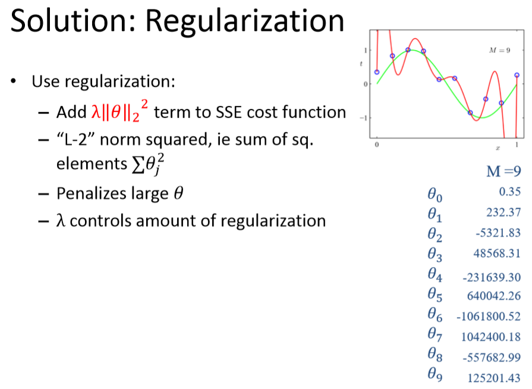

# Overfitting
###### Author: Ziqi Tan
###### Date: Feb 23, 2020
--- 
## Consequence

Overfitting is also called **poor generalization**.

## Detecting overfitting
Plot model complexity versus object function on test/train data.

As model becomes more complex, performance on training keeps improving while on test data it increases.

**x-axis:** measure of model complexity In this example, we use the maximum order of the polynomial basis functions. 

**y-axis:**  
For regression, it would be SSE or mean SE (MSE).  
For classification, the vertical axis would be classification error rate or cross-entropy error function 
 
## Overcome overfitting
1. Use more training data.
2. Regularization.
3. Cross-validation.

## Regularization

$$
J(\theta) = \frac{1}{2m}[\sum_{i=1}^{m}(h_{\theta}(x^{(i)}) - y^{(i)})^{2}
+\lambda \sum_{j=1}^{n}\theta_j^2]
$$

where the regularization can be written as a matrix form:
$$
\theta^T A \theta
$$
where $A$ is a symmetric matrix, serving the same purpose as $\lambda$ does.

### L2 Regularization
1 norm:
$$
||W||_1 = |W_1| + |W_2| + ... + |W_N|
$$
2 norm:
$$
||W||_2 = (|W_1|^2 + |W_2|^2 + ... + |W_N|^2)^{\frac{1}{2}}
$$

p norm:
$$
||W||_p = (|W_1|^p + |W_2|^p + ... + |W_N|^p)^{\frac{1}{p}}
$$

### Gradient descent
Repeat {
$$\theta_j = \theta_j - \alpha \frac{1}{m}[\sum_{i=1}^{m}(h_{\theta}(x^{(i)}) - y^{(i)})x_j
+\lambda\theta_j]
$$
} until convergence.

## Cross-Validation
Validation用来调参和跑分，Test用来跑分，不用来调参。

