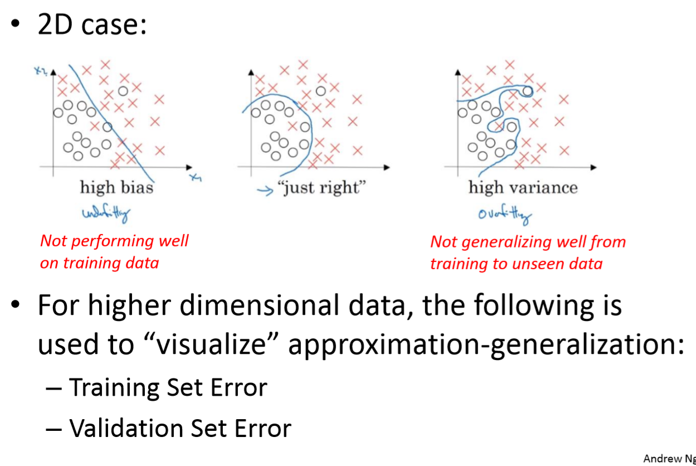
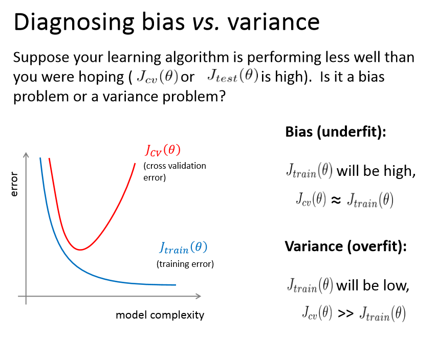
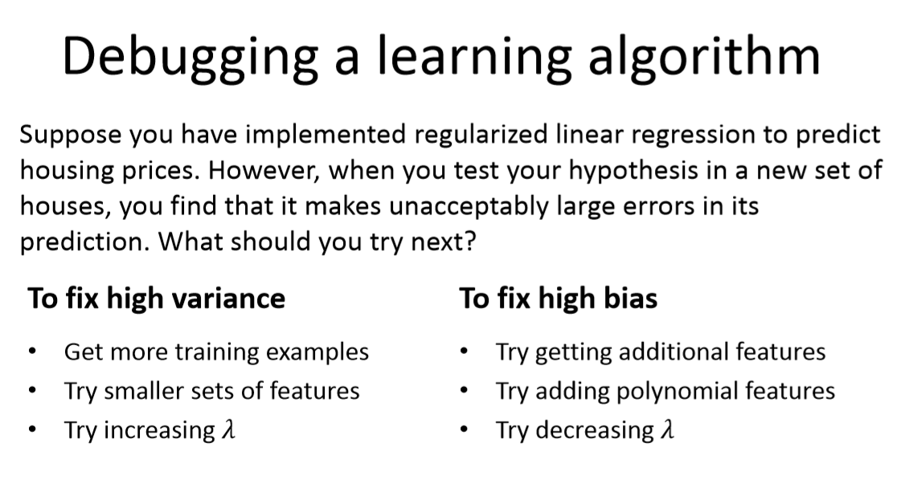

# Bias-Variance
###### Author: Ziqi Tan
###### Date: Feb 23, 2020
--- 

## Approximation-Generalization Tradeoff

There is a trade-off between bias and variance: 
* **Less complex** models (fewer parameters) have high bias and hence low variance.
* **More complex** models (more parameters) have low bias and hence high variance.
* **Optimal model** will have a balance.

