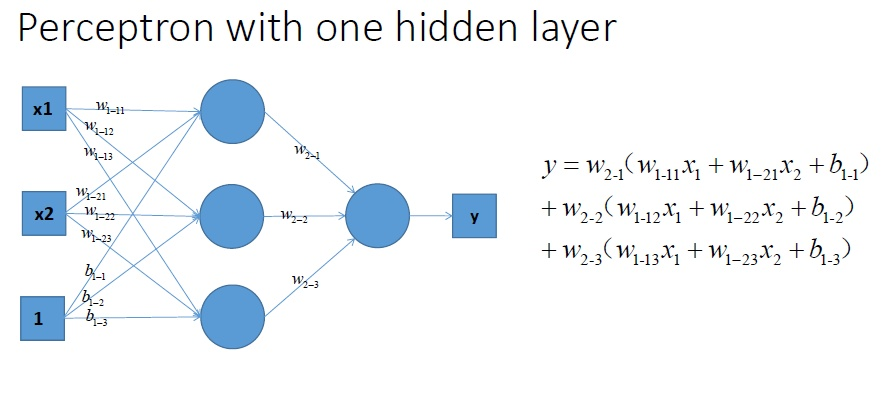

# Activation function

## Reference
https://www.zhihu.com/question/22334626

https://en.wikipedia.org/wiki/Activation_function

## Definition

The activation function of a node defines the output of that node given an input or set of inputs.

## Why do we need it?
为什么说activation function能实现非线性的分类？

### 没有hidden layer的神经网络 --- 线性划分
这是一个单层的感知机, 也是我们最常用的神经网络组成单元啦. 用它可以划出一条线, 把平面分割开。

### 推广到全连接
那么很容易地我们就会想用多个感知机来进行组合, 获得更强的分类能力:

### 如果加上隐藏层(不管加上多少层)，分类器还是线性的

当然你可以说我们可以用无限条直线去逼近一条曲线啊！额,当然可以,不过比起用non-linear的activation function来说就太萌了！

### 每一层叠加完了以后, 加一个激活函数

### 复杂一点

加上非线性激活函数之后, 我们就有可能学习到这样的平滑分类平面。

### 

## Most common use activation functions

### sigmoid
See in 02-Classification.md Sigmoid Function.

### ReLu 整流线性单位函数（Rectified Linear Unit, ReLU）

The rectifier is an activation function defined as the positive part of its argument:

$$
f(x) = \max(0, x)
$$
where x is the input to a neuron.

When $x=0$, $f(x)$ is not differentiable.

Thus, we have this **softplus or SmoothReLU function**.

$$
f(x)=ln(1+e^x)
$$

The Derivative is $f'(x) = \frac{1}{1+e^{-x}}$, logistic function.

### TanH (hyperbolic tangent)
$$
tanh(x) = sinh(x) / cosh(x) = \frac{e^x-e^{-x}}{e^x+e{-x}}
$$

