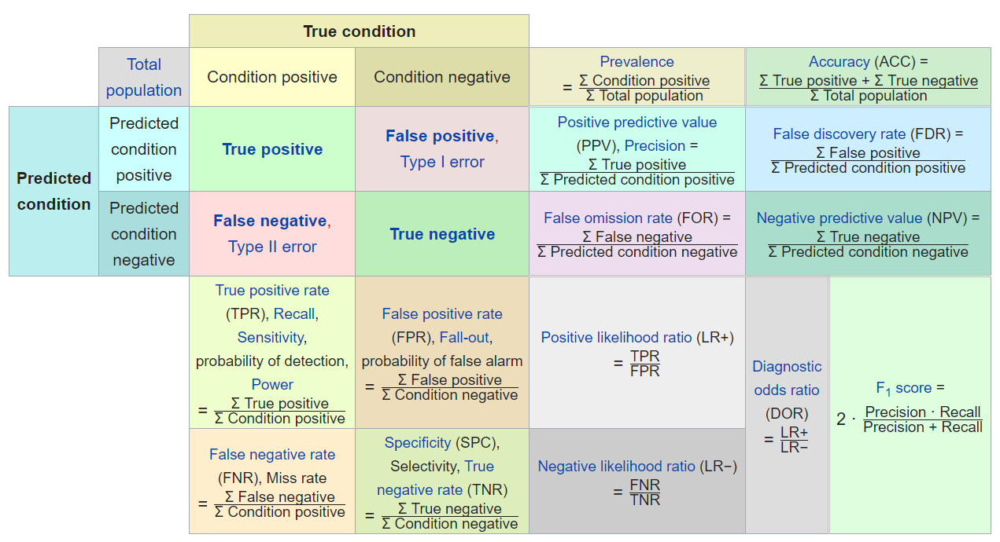

# Confusion matrix

Prediction: Position or Negetaive
Ground Truth: True or False

如果预测是Positive, 预测对了，就是True Positive.

一共预测对了多少。
$$
Accuracy = \frac{TP+TF}{N}
$$

在你所有预测的阳性里面，有多少真的是阳性。
$$
Precision = \frac{TP}{Predicte \ Positive}
$$

召回率：在实际上是阳性的人里面，你能找出多少。
$$
Recall = \frac{TP}{Actual \ Positive}
$$
