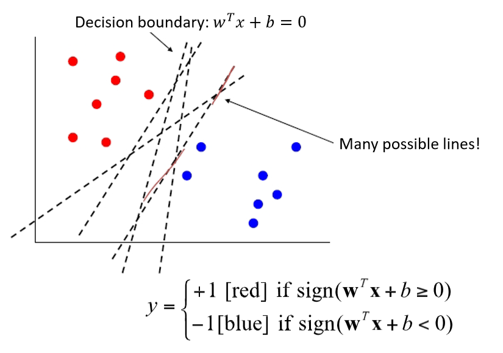
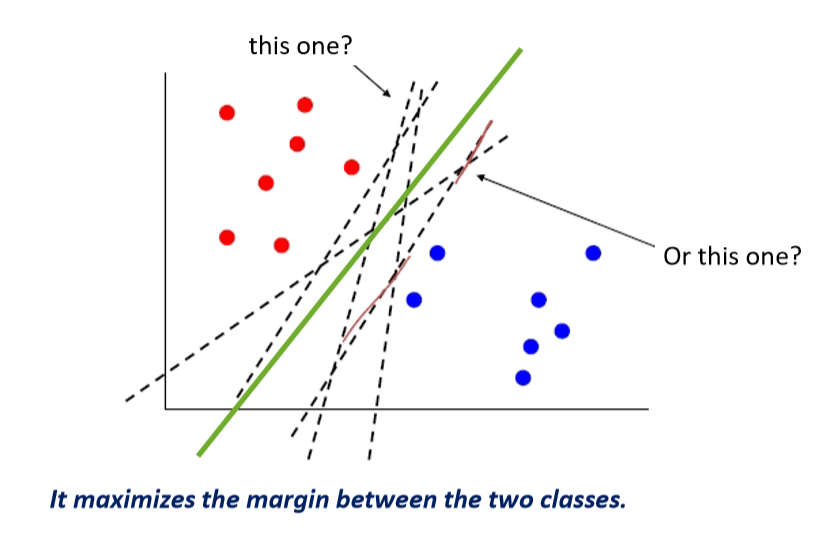
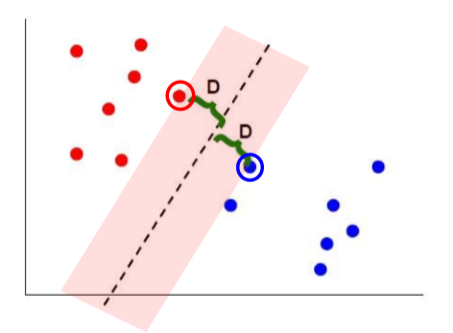
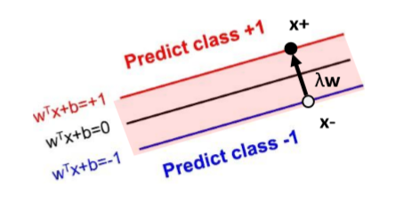

# Support Vector Machine

A supervised learning model.

## Motivation and Logistics
- A **maximum margin method**, can be used for classification or regression.
- SVMs can efficiently perform a non-linear classification using what is called the **kernel trick**, implicitly mapping their inputs into high-dimensional feature spaces.
- First, we will derive **linear, hard-margin SVM** for linearly separable data, later for non-separable (soft margin SVM), and for nonlinear boundaries (kernel SVM).

## Maximum Margin

### Motivation
看一个二分类问题，现在可以有很多个Decision boundary，到底哪个才是最好的。

那当然是能远离所有点的那条线是最好的，如下图的绿线。

我们只需要关注boundary points.

我们的目标就是：learn a boundary that leads to the largest margin.

为什么叫支持向量？

Subset of vectors that support determine boundary are called the **support vectors (circled)**.

### Max Margin Classfier
我们对刚刚得到的decision boundary进行平移，得到一个margin.

我们看二分类问题，标签为1和-1，当然也可以标记为两个常数。

$$
Class: +1 \ \ \ if \ w^Tx+b \geq 1
$$

$$
Class: -1 \ \ \ if \ w^Tx+b \leq 1
$$

$$
Class: Undefine  \ \ \ if  -1 < w^Tx+b < 1
$$

假设现在如图这两个点$x^+$和$x^-$，是两个支持向量。

易知，
$$
w^Tx^+ + b = 1
$$

$$
w^Tx^- + b = -1
$$

则，
$$
w^T(x^+ - x^-) = 2
$$

我们需要maximize 
$$
|| x^+ - x^- || 
$$
那我们如何用$w$来表示上式呢？

我们，需要引入一个中间变量$\lambda$.
令
$$
x^+ - x^- = \lambda w
$$

代入下式，
$$
w^Tx^+ + b = 1
$$
得到：
$$
w^T(\lambda w + x^-) + b = 1
$$

$$
w^Tx^-+b+\lambda w^Tw = 1
$$

$$
-1 + \lambda w^Tw = 1
$$

$$
\lambda = \frac{2}{w^Tw}
$$

现在我们可以求
$$
|| x^+ - x^- || = || \lambda w|| = \lambda \sqrt{w^Tw} = \frac{2}{\sqrt{w^Tw}}
$$

Maximizing the margin is equivalent to regularization.

最大化这个margin相当于防止overfitting.

## Linear SVM
对于可以线性分类的问题。
我们这个模型要学习的是$w$和$b$这两个参数。

### Formulation
Objective function:
$$
min \frac{1}{2}||w||^2
$$

$$
s.t. (w^T x_i + b)y_i \geq 1, \forall i
$$

如果样本标签为1，分类结果为-1或者0.5或者-0.5，都会破坏这个约束。

This is the primal formulation.

Apply Lagrange multipliers: formulate equivalent problem.

使用拉格朗日乘子，转化为等价问题。

