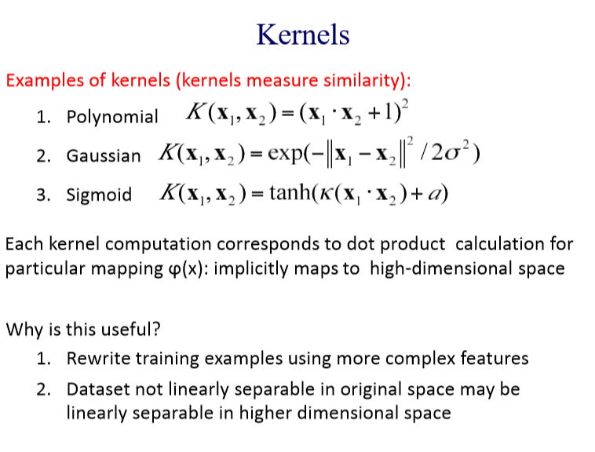

# Support Vector Machine

A supervised learning model.

## Motivation and Logistics
- A **maximum margin method**, can be used for classification or regression.
- SVMs can efficiently perform a non-linear classification using what is called the **kernel trick**, implicitly mapping their inputs into high-dimensional feature spaces.
- First, we will derive **linear, hard-margin SVM** for linearly separable data, later for non-separable (soft margin SVM), and for nonlinear boundaries (kernel SVM).

## Maximum Margin

### Motivation
看一个二分类问题，现在可以有很多个Decision boundary，到底哪个才是最好的。

那当然是能远离所有点的那条线是最好的，如下图的绿线。

我们只需要关注boundary points.

我们的目标就是：learn a boundary that leads to the largest margin.

为什么叫支持向量？

Subset of vectors that support determine boundary are called the **support vectors (circled)**.

### Max Margin Classfier
我们对刚刚得到的decision boundary进行平移，得到一个margin.

我们看二分类问题，标签为1和-1，当然也可以标记为两个常数。

$$
Class: +1 \ \ \ if \ w^Tx+b \geq 1
$$

$$
Class: -1 \ \ \ if \ w^Tx+b \leq 1
$$

$$
Class: Undefine  \ \ \ if  -1 < w^Tx+b < 1
$$

**我们怎么确定支持向量？**

假设现在如图这两个点$x^+$和$x^-$，是两个支持向量。

易知，
$$
w^Tx^+ + b = 1
$$

$$
w^Tx^- + b = -1
$$

则，
$$
w^T(x^+ - x^-) = 2
$$

我们需要maximize 
$$
|| x^+ - x^- || 
$$
那我们如何用$w$来表示上式呢？

我们，需要引入一个中间变量$\lambda$.
令
$$
x^+ - x^- = \lambda w
$$

代入下式，
$$
w^Tx^+ + b = 1
$$
得到：
$$
w^T(\lambda w + x^-) + b = 1
$$

$$
w^Tx^-+b+\lambda w^Tw = 1
$$

$$
-1 + \lambda w^Tw = 1
$$

$$
\lambda = \frac{2}{w^Tw}
$$

现在我们可以求
$$
|| x^+ - x^- || = || \lambda w|| = \lambda \sqrt{w^Tw} = \frac{2}{\sqrt{w^Tw}}
$$

Maximizing the margin is equivalent to regularization.

最大化这个margin相当于防止overfitting.

## Linear SVM
对于可以线性分类的问题。
我们这个模型要学习的是$w$和$b$这两个参数。

### Formulation
Objective function:
$$
min \frac{1}{2}||w||^2
$$

$$
s.t. (w^T x_i + b)y_i \geq 1, \forall i
$$

如果样本标签为1，分类结果为-1或者0.5或者-0.5，都会破坏这个约束。

This is the primal formulation.

Apply Lagrange multipliers: formulate equivalent problem.

使用拉格朗日乘子，转化为没有约束的等价问题。

### Lagrange multipliers
Convert the primal constrained minimization to an unconstrained optimization problem: represent constraints as penalty  terms:

$$
\min_{w, b} \frac{1}{2}||w||^2 + penalty
$$
对每个样本$\{(x_i, y_i)\}$的惩罚求和，
$$
penalty = \sum_{i=1}^{n}\max_{\alpha_i \geq 0} \alpha_i[1-(w^Tx_i + b)y_i]
$$
其中，n是样本数量，$\alpha_i$是拉格朗日乘子。

**max在这里到底是约束还是变量？**

如果约束满足：
$$
1-(w^Tx_i + b)y_i \leq 0 
$$

如果约束不满足：
$$
1-(w^Tx_i + b)y_i > 0
$$
大的拉格朗日乘子$\alpha_i$，确保惩罚足够大。

**提问，阿尔法怎么设？**

得到，
$$
\min_{w, b} \{\frac{1}{2}||w||^2 + \sum_{i=1}^{n}\max_{\alpha_i \geq 0} \alpha_i[1-(w^Tx_i + b)y_i]\}
$$

代价函数：
$$
\max_{\alpha_i \geq 0}\min_{w,b} J(w,b;\alpha) = 
\max_{\alpha_i \geq 0}\min_{w,b} \{ \frac{1}{2}||w||^2 + \sum_{i=1}^{n} \alpha_i[1-(w^Tx_i + b)y_i] \}
$$

对w, b求偏导，
$$
\frac{\partial J(w,b;\alpha)}{\partial w}
= w - \sum_{i=1}^{n}\alpha_i x_i y_i = 0
$$

$$
\frac{\partial J(w,b;\alpha)}{\partial b}
= -\sum_{i=1}^{n}\alpha_i y_i = 0
$$

### Dual problem
重新代进原式，得到Dual problem，现在我们需要优化$\alpha$，训练的时候，我们
$$
L = \max_{\alpha_i \geq 0} \{ \sum_{i=1}^{n}\alpha_i - \frac{1}{2} \sum_{i,j=1}^{n} y_i y_j \alpha_i \alpha_j (x_i^T x_j)\}
$$

$$
s.t. \alpha_i \geq 0; \sum_{i=1}^{n}\alpha_i y_i = 0
$$

Then use the obtained $\alpha_i$'s to solve for the weights and bias:

$$
w = \sum_{i=1}^{n} \alpha_i y_i
 x_i 
$$

$$
b = y_i - w^T x_i 
$$

In practice, predict
$$
y = sign[w^Tx+b]
$$

### Primal v.s. Dual Problem

## Soft margin and slack variables

$\xi$的取值，如图所示，如果红点在+1平面的左方，$\xi$为0，如果在决策平面的左方，+1平面的右方，取值则为(0,1)，如果在决策平面另一侧，取值则大于1.

## Kernel trick for non-linear decision boundary

虽然可以用high order polynomial features，我们就希望用一个变换，把这些数据变得linear seperable,然后用linear SVM.

### Input transformation

### Lankmark (Kernel Function)

Given data set
$$
(x^{(1)}, y^{(1)}), (x^{(2)}, y^{(2)}), ..., (x^{(m)}, y^{(m)})
$$

Choose lankmarks
$$
l^{(1)} = x^{(1)}, l^{(2)} = x^{(2)}, ..., l^{(m)} = x^{(m)}
$$

原来的预测函数是这样：
Predict "1" when: 
$$
\theta_0 + \theta_1 x_1 + \theta_2 x_2 + ... + \theta_n x_n \geq 0
$$
经过变换以后：
Predict "1" when: 
$$
\theta_0 + \theta_1 f_1 + \theta_2 f_2 + ... + \theta_n f_n \geq 0
$$
其中，$f_i$就是Kernel Function.

Kernel Function需要自行选择，比如选的是高斯分布。

$$
f_i = similarity(x, l^{(i)}) = \exp(-\frac{||x-l^{(i)}||^2}{2\sigma^2})
$$
分布的参数需要自己设定，例如，我们这里设置均值为样本数据点本身，方差另外设定。

