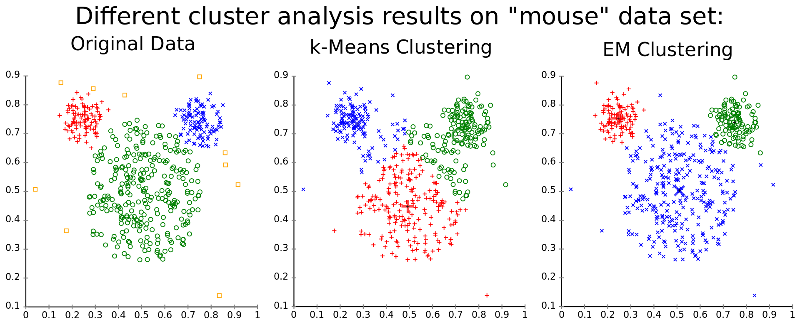
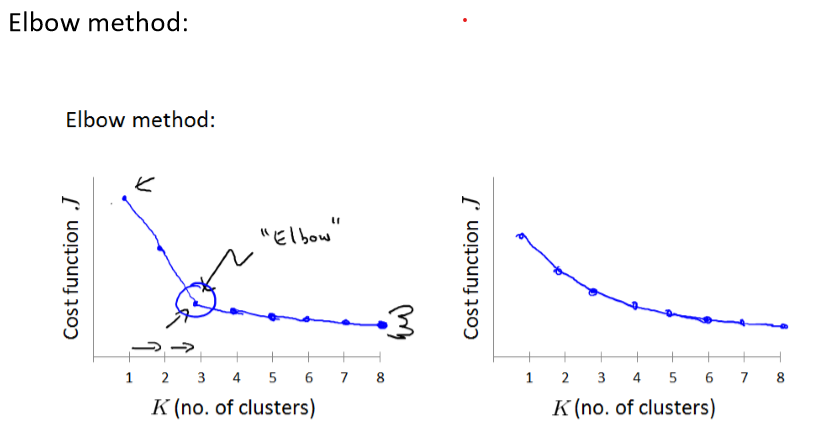
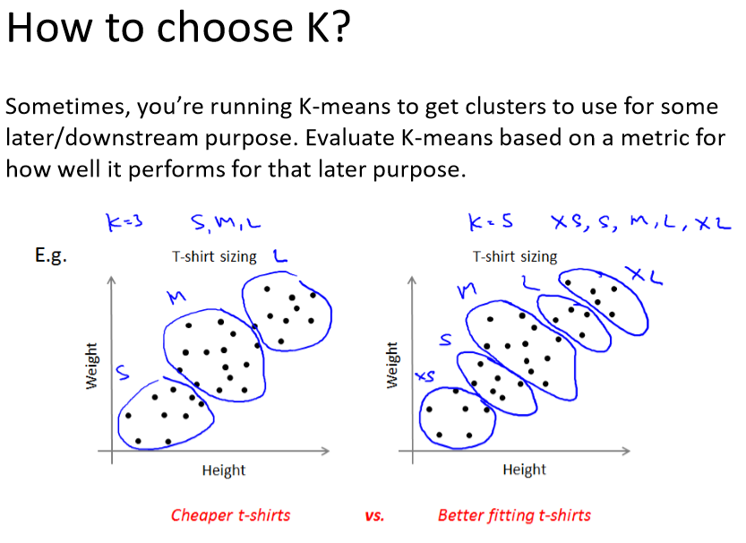

# Clustering

###### Author: Ziqi Tan
###### Date: Feb 23, 2020
--- 

## Definition
**Cluster analysis or clustering** is the task of grouping a set of objects in such a way that objects in the same group (called a cluster) are more similar (in some sense) to each other than to those in other groups (clusters).

## K Means Clustering Algorithm

### Input:
- k (an integer, number of clusters);
- Training set ${x^{(1)}, x^{(2)}, ... , x^{(m)} }$

### Output:
- Result set 

### Algorithm:
Randomly initialize K cluster centroids $u_1, u_2, ... , u_k$.

Repeat {

1. Assign m samples to their closest cluster centroids.
For example, point A now is closest to cluster centroid 3, and then A is assigned to cluster 3.
2. Update K cluster centroids by averaging the current clustering points. 
For example, updating cluster 3's centroid with the average of all the points in cluster 3.
}

### How to choose K?

## Application of Clustering

