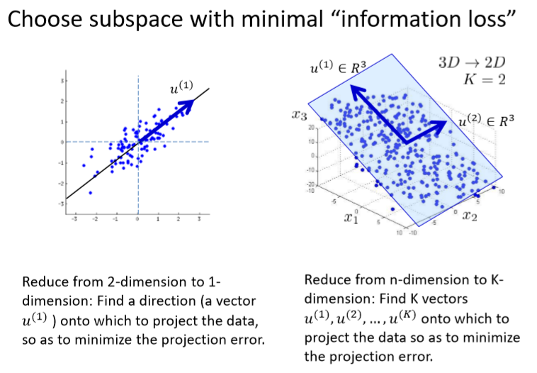

# Dimensionality Reduction
###### Author: Ziqi Tan
###### Date: Feb 23, 2020
--- 

## References
https://stats.stackexchange.com/questions/134282/relationship-between-svd-and-pca-how-to-use-svd-to-perform-pca

https://my.oschina.net/findbill/blog/535044

# Principal Component Analysis (PCA)

## Motivation -- Dimensionality Reduction

1. Data normalization to have zero mean and unit standard deviation.
2. Compute the covariance matrix of the data.
3. SVD. Decompose the matrix wich Singular Value Decomposition to obtains its eigenvectors/values. 
4. Project each point onto the top k eigenvectors to obtain the lower dimensional points.

## Data Preprocessing

## PCA Algorithm

## PCA components

## Projection/Reconstruction Error

