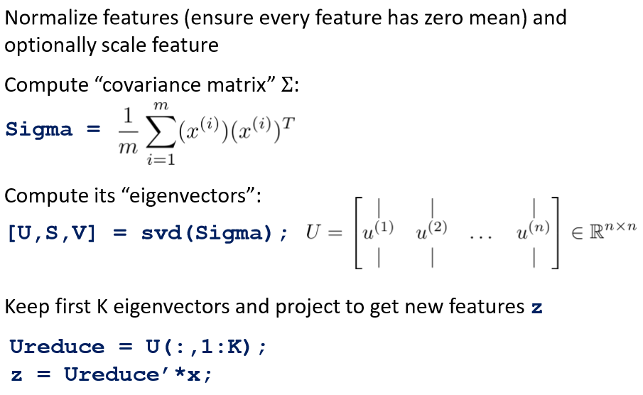

# Dimensionality Reduction
###### Author: Ziqi Tan
###### Date: Feb 23, 2020
--- 

## References
https://stats.stackexchange.com/questions/134282/relationship-between-svd-and-pca-how-to-use-svd-to-perform-pca

https://my.oschina.net/findbill/blog/535044

# Principal Component Analysis (PCA)

## Motivation

## Data Preprocessing

## PCA Algorithm

## Projection/Reconstruction Error

