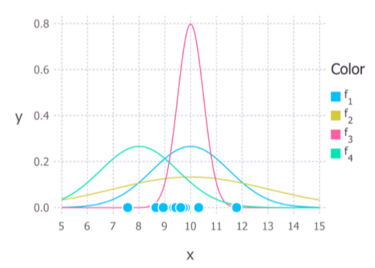
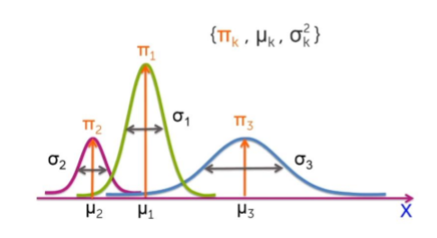
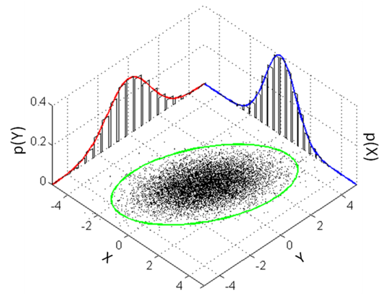
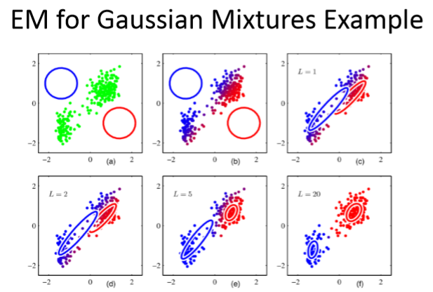

# Mixtures of Gaussians

## Single Gaussian
We want to know which curve was most likely responsible for creating the data points that we observed? 

### Maximum Likelihood Estimates

#### Important assumption
Each data point is generated independently of the others.

#### Gaussian distribution
$$
P(x; \mu, \sigma) = 
\frac{1}{\sigma \sqrt{2\pi}}
\exp(-\frac{(x-\mu)^2}{2\sigma^2})
$$

#### Joint Gaussian Distribution
$$
P(9, 9.5, 11; \mu, \sigma) = 
\frac{1}{\sigma \sqrt{2\pi}} 
\exp(-\frac{(9-\mu)^2}{2\sigma^2}) \times
\frac{1}{\sigma \sqrt{2\pi}}
\exp(-\frac{(9.5-\mu)^2}{2\sigma^2}) \times
\frac{1}{\sigma \sqrt{2\pi}}
\exp(-\frac{(11-\mu)^2}{2\sigma^2})
$$

#### Calculating Maximum Likelihood Estimates
- We need to find the values of μ and σ that results in giving the maximum value of the above expression. 
- The above expression for the total probability is difficult to differentiate. 
- It is almost always simplified by taking the **natural logarithm** of the expression.  

### Log Likelihood
This is absolutely fine because the **natural logarithm** is a monotonically increasing function.

Taking logs of the original expression gives us:
$$
\ln(P(9, 9.5, 11; \mu, \sigma)) = 
\ln(\frac{1}{\sigma \sqrt{2\pi}})
-\frac{(9-\mu)^2}{2\sigma^2} + \ln(\frac{1}{\sigma \sqrt{2\pi}})
-\frac{(9.5-\mu)^2}{2\sigma^2} + \ln(\frac{1}{\sigma \sqrt{2\pi}})
-\frac{(11-\mu)^2}{2\sigma^2}
$$

By simplifying it, we get:
$$
\ln(P(9, 9.5, 11; \mu, \sigma)) = 
-3\ln(\sigma) - \frac{3}{2}\ln(2\pi) - \frac{1}{2\sigma^2}[(9-\mu)^2+(9.5-\mu)^2+(11-\mu)^2]
$$

#### Computing $\mu_{ML}$ and $\sigma_{ML}$
Take partial derivative of $\mu$ and $\sigma_{ML}$ and set them to zero.

$$
\frac{\partial \ln(P(x; \mu, \sigma))}{\partial \mu}
= \frac{1}{\sigma^2}[9+9.5+11-3\mu] = 0
$$

$$
\mu_{ML} = 9.833
$$

Do the same thing to $\sigma$.

## Mixtures of Gaussians
GMM (Gaussians Mixed Model)

$$
p(x) = \sum_{k=1}^{K}\pi_k [\frac{1}{\sigma \sqrt{2\pi}}
\exp(-\frac{(x-\mu_k)^2}{2\sigma_k^2})]
$$

where $\sum_{k=1}^{K}\pi_k = 1$ and $0 \le \pi_k \le 1$.

Associate **a weight $\pi_k$** with each Gaussian Component: **"The mixing coefficients"**.

### Higher Dimension
Multivariate normal distribution:
$$
f(x_1, x_2, ... , x_N) = \frac{1}{\sqrt{(2\pi)^N{|\Sigma|}}}\exp(-\frac{1}{2}({{X}-\mu})^T {\Sigma}^{-1}({{X}-\mu}))
$$
where ${\Sigma}$ is the **covariance matrix** of ${X}$, $X$ and $\mu$ are N by 1 matrice.

$$
X = (x_1, x_2, ... , x_N)^T
$$
Then, we will have the covariance matrix:
$$
\Sigma_{i,j} = cov(x_i, x_j) = E[(x_i-E[x_i])(x_j-E[x_j])]
= E[x_ix_j] - E[x_i][x_j]
$$

Correlation coefficient:
$$
\rho_{x_i, x_j} = \frac{cov(x_i, x_j)}{\sigma_{x_i}\sigma_{x_j}}

$$

#### Two Dimension

$$
f(x_1, x_2) = \frac{1}{2\pi \sigma_{x_1}\sigma_{x_2} \sqrt{1-\rho^2}}
\exp(-\frac{1}{2(1-\rho^2)}[\frac{(x_1-\mu_{x_1})}{\sigma_{x_1}^{2}} + \frac{(x_2-\mu_{x_2})}{\sigma_{x_2}^{2}}-\frac{2\rho(x_i - \mu_{x_i})(x_j - \mu_{x_j})}{\sigma_{x_i}\sigma_{x_j}}])
$$
where 
$$
\Sigma =
 \begin{bmatrix}
   \sigma_{x_1}^2 & \rho\sigma_{x_1}\sigma_{x_2} , \
   \rho\sigma_{x_1}\sigma_{x_2} & \sigma_{x_1}^2  
  \end{bmatrix} 
$$

### Maximum Likelihood
Mixture of Gaussians:
$$
p(X) = \sum_{k=1}^{K}\pi_k \ N( X | \mu_k, \Sigma_{k})
$$
The dimension of each Gaussian is $N$. We have $K$ Gaussian distrubutions in all.

We can estimate parameters using Maximum Likelihood, i.e. maximize 

$$
\ln(p(X|\pi, \mu, \Sigma))
= \ln p(x^1, x^2, ..., x^N | \pi_1, ... , \pi_K, \mu_1, ..., \mu_k, \Sigma_1, ... , \Sigma_K)
$$

This algorithm is called **Expectation Maximization (EM)**.

### Expectation Maximization

1. Initialize the means $\mu_k$, covariances $\Sigma_k$ and mixing coefficients $\pi_k$ and evaluate the initial value of the log likelihood.
2. E step. Evaluate the responsibility value using the current parameter values. 
$$
p(z_k|x_i) = \frac{\pi_k N(x_i|\mu_k, \Sigma_k)}{\Sigma_{j=1}^{K}N(x_i | \mu_j, \sigma_j)}
$$
其中，$i = 1, 2, 3, ..., m$，m为总样本数，K为高斯分布的个数。计算各个数据样本$x_i$属于第k个cluster的概率。

3. M step. Re-estimate the parameters using the current responsibilities. 根据刚刚得出的概率，重新计算means $\mu_k$, covariances $\Sigma_k$ and mixing coefficients $\pi_k$.

重新计算各个高斯分布的权重(mixing coefficients) 
$$
\pi_k = \frac{1}{m}\Sigma_{i=1}^{m}p(z_k|x_i)
$$

均值的计算，例如，第k个高斯分布的均值：
$$
\mu_k^{new} = \frac{\Sigma_{i=1}^{m}p(z_k|x_i)x_i}{\Sigma_{i=1}^{m}p(z_k|x_i)}
$$

协方差矩阵的计算，
$$
\Sigma_k^{new} = \frac{\Sigma_{i=1}^{m}p(z_k|x_i)(x_i-\mu_k^{new})(x_i-u_k^{new})^T}{\Sigma_{i=1}^{m}p(z_k|x_i)}
$$

4. 重复E-step and M-step直到收敛。

那这跟Maximum Likelihood又有什么关系呢？
我们的每一步，实际上都是在maximize p(x).
